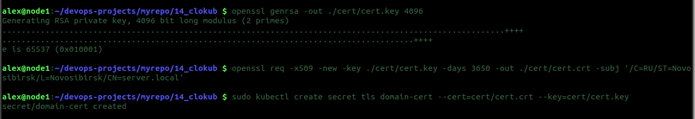
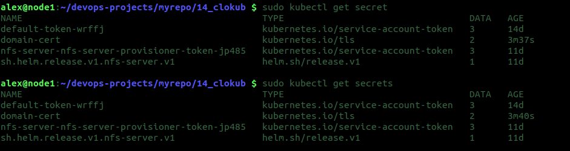
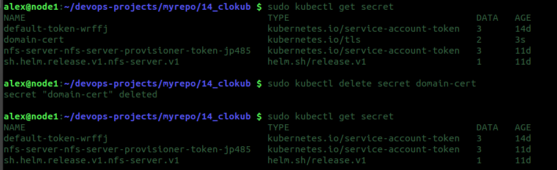
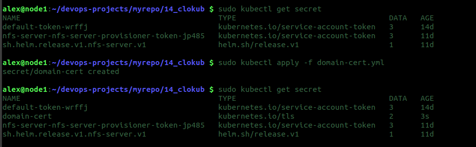

# Задача 1: Работа с секретами через утилиту kubectl в установленном minikube

## Как создать секрет?


Создадим ключи

```bash
alex@node1:~/devops-projects/myrepo/14_clokub $ openssl genrsa -out ./cert/cert.key 4096
Generating RSA private key, 4096 bit long modulus (2 primes)
...............................++++
.....................................................................................................................................................................................................++++
e is 65537 (0x010001)

alex@node1:~/devops-projects/myrepo/14_clokub $ openssl req -x509 -new -key ./cert/cert.key -days 3650 -out ./cert/cert.crt -subj '/C=RU/ST=Novosibirsk/L=Novosibirsk/CN=server.local'

```

Создадим секрет

```bash
alex@node1:~/devops-projects/myrepo/14_clokub $ sudo kubectl create secret tls domain-cert --cert=cert/cert.crt --key=cert/cert.key
secret/domain-cert created

```

## Как просмотреть список секретов?


Просмотр списка секретов 

```bash
alex@node1:~/devops-projects/myrepo/14_clokub $ sudo kubectl get secret
NAME                                            TYPE                                  DATA   AGE
default-token-wrffj                             kubernetes.io/service-account-token   3      14d
domain-cert                                     kubernetes.io/tls                     2      3m37s
nfs-server-nfs-server-provisioner-token-jp485   kubernetes.io/service-account-token   3      11d
sh.helm.release.v1.nfs-server.v1                helm.sh/release.v1                    1      11d

alex@node1:~/devops-projects/myrepo/14_clokub $ sudo kubectl get secrets
NAME                                            TYPE                                  DATA   AGE
default-token-wrffj                             kubernetes.io/service-account-token   3      14d
domain-cert                                     kubernetes.io/tls                     2      3m40s
nfs-server-nfs-server-provisioner-token-jp485   kubernetes.io/service-account-token   3      11d
sh.helm.release.v1.nfs-server.v1                helm.sh/release.v1                    1      11d

alex@node1:~/devops-projects/myrepo/14_clokub $ 

```

## Как просмотреть секрет?

```bash
alex@node1:~/devops-projects/myrepo/14_clokub $ sudo kubectl get secrets domain-cert
NAME          TYPE                DATA   AGE
domain-cert   kubernetes.io/tls   2      6m26s

```

## Как получить информацию в формате YAML и/или JSON?

```bash
alex@node1:~/devops-projects/myrepo/14_clokub $ sudo kubectl get secret domain-cert -o yaml
apiVersion: v1
data:
  tls.crt: LS0tLS1CRUdJTiBDRVJUSUZJQ0FURS0tLS0tCk1JSUZnVENDQTJtZ0F3SUJBZ0lVUVVjRXV2Y1pIWmRXK0oraXJlS0E5ajZ0d3Rzd0RRWUpLb1pJaHZjTkFRRUwKQlFBd1VERUxNQWtHQTFVRUJoTUNVbFV4RkRBU0JnTlZCQWdNQzA1dmRtOXphV0pwY25Ock1SUXdFZ1lEVlFRSApEQXRPYjNadmMybGlhWEp6YXpFVk1CTUdBMVVFQXd3TWMyVnlkbVZ5TG14dlkyRnNNQjRYRFRJeE1Ea3hNakV6Ck5EYzBOMW9YRFRNeE1Ea3hNREV6TkRjME4xb3dVREVMTUFrR0ExVUVCaE1DVWxVeEZEQVNCZ05WQkFnTUMwNXYKZG05emFXSnBjbk5yTVJRd0VnWURWUVFIREF0T2IzWnZjMmxpYVhKemF6RVZNQk1HQTFVRUF3d01jMlZ5ZG1WeQpMbXh2WTJGc01JSUNJakFOQmdrcWhraUc5dzBCQVFFRkFBT0NBZzhBTUlJQ0NnS0NBZ0VBdGMrWlN4REJvZkQxClE2b0lhSklDMG51d3RnOHo4dVJtVU1RN215cGFDY05wVHV1MTl3czVSeFNGVGZ0a3lYK1JJdUw0Mmd4MElGck8KWkYwMGVzTXM0THNUY3lBbEdaeGxuUVhxTlJmaThmbThQbXFmSmNKUTNnZGd3ZlJuZHdTRFNiNXovUk00Qk9tTQovYWVzQ2g4eWd0UlUrc2UwUWJ5UDNidWtpbkxUamExSW1BRDdIeTJHRUExbkgybXM1TjJPWFprV25FM0IranlOCkRjb3NxTzdsNThSVzdwOVpSYWEweTNSaHVPTkIzOFlRS2V6SGt2YWMwTWJlclY1OExpVUhFWitxREZTOFkwcXkKMEYzVnFqbjZPd3Y5dXIzWUpDQzZmNlFSMHowbzh2dWgxZ1QyUmlHK3l5alR2WmlGREM4aTB0VE9nQ0EyV2puVwpHSTJLOXhIY0kzTWZzeGd6aGI2Mm1GcjdvWHhsZjJIQTd1NnEzRXlPZWtCNW5SclVwU3ZiSWpibFNNMXJvQk9QCjR5RE5DdzlvaUVjdVkyN3hYcEJsNnJuVitocm83THFPSmNnd2pSYzVCeHF4T1RXRmJzK2Nna3VnalFxOHU0ZDMKSm5kMU9YaVVaRFg2OGtEWmdJN1llVWRPQmlCU1dHaTlZVHNTU2d0U2NPVi9vaUdaMDNMWXV6WDdSRis0VHRsZQoyeStuejYwVzY4a1dxMitKNU9VZTVjYnBpWVYraXlDTmtGb1hzUjdoSUcyYWZtT1BvTHkrSU5EejZPM3ZVdFB3CkxLWnNzWS85aGRRVWJjb0VpTkg2dzdhdk10OWd0MmZTejRVUS9DQWxyZEhVckRmdFpsMnFsdzloVFBUckhjOHEKZWVCU0JqM2FjNXFBUjlhYjRrM1I2b2JBWkFRWERQc0NBd0VBQWFOVE1GRXdIUVlEVlIwT0JCWUVGTFRwUHhYVwpONXRuZUhib2Flb2xjVlduN0xGUk1COEdBMVVkSXdRWU1CYUFGTFRwUHhYV041dG5lSGJvYWVvbGNWV243TEZSCk1BOEdBMVVkRXdFQi93UUZNQU1CQWY4d0RRWUpLb1pJaHZjTkFRRUxCUUFEZ2dJQkFCNGtQalQyQ1hRZ1BFRTEKdCt6WTE2dDlPeTg3VjMxdVY1YVU5QThJRHoxSWhlc0FSTWNudERGaGNVNGM3SWhXaGxvMnlDbGREUW0rSWJvagpWaTV3K0t4ZVN4c2NLU29yekRiQVMrWTNGSlRHTVZBL0JEY1BiY2JtQmNBa2haaE1RYldNM0FZWmU5cVpURTdWCklzOGVuMGJsdTFhbU03UTM0Tk93ZklOODZ2RDNIb0lFUWFtTURFWDlVYUdXdGxuWkNMcm1XTkIvQUhENW1vNDUKMWlBOHJLTE51bWxVSlg5aC9vSW9IY1l6RVB3Sy9VekszemhCZ0phbk94U3lDbmREM29FR2Y0b0xNTnRQOFY0aQo2Y2VYNVhMa1BCbW1PMU04Z29LaE9RemdPeXBVVHV5ZWlGbndqM0xXcFovRmdLL0ZTc2pSbXpBb2p4QmQyKzM0CkkwS24zOWVQcW1hUDZEZFIrR1U0eFJxRmZiZVRERmlvV0hzMTdla1BuZEY3MkZmU215VXREbUE3amFtb0NpQi8KWGpxNGZJYjFBNklrTldUTStOdlZabWxLRXp0d2pOUlJlVTJKcnNpaExSMHBqbU5xWGlrQTlkTGpWVGluYWNabgpFem1aeWxDbEdoTDAyNTlHcEJBZ3hTYldxQk1MMnQycmk4bng1UG9YNHJybXRvUUpTcDVRSk5zcUxNOU5xeVdCCjlJVlJrRGlqc09vNUQ4bms0ZUlpWEFXTFNoTi9vSkkwODllL2tXM2dEQ05ybG9EaW40Mml5LzNLaTFWU2J4OXkKaUlQZGtTclhWdHhSSG8rKzFLR3JtSzdENjVNVkxlZU1qN1I5TXBHcnNhdStmVlQ2QzJkU0JCQjAvdDNQNzdMWgp0L0ZsVm44aFZUSlc0OGdxekZ5WUdrZVBqNzdjCi0tLS0tRU5EIENFUlRJRklDQVRFLS0tLS0K
  tls.key: LS0tLS1CRUdJTiBSU0EgUFJJVkFURSBLRVktLS0tLQpNSUlKS0FJQkFBS0NBZ0VBdGMrWlN4REJvZkQxUTZvSWFKSUMwbnV3dGc4ejh1Um1VTVE3bXlwYUNjTnBUdXUxCjl3czVSeFNGVGZ0a3lYK1JJdUw0Mmd4MElGck9aRjAwZXNNczRMc1RjeUFsR1p4bG5RWHFOUmZpOGZtOFBtcWYKSmNKUTNnZGd3ZlJuZHdTRFNiNXovUk00Qk9tTS9hZXNDaDh5Z3RSVStzZTBRYnlQM2J1a2luTFRqYTFJbUFENwpIeTJHRUExbkgybXM1TjJPWFprV25FM0IranlORGNvc3FPN2w1OFJXN3A5WlJhYTB5M1JodU9OQjM4WVFLZXpICmt2YWMwTWJlclY1OExpVUhFWitxREZTOFkwcXkwRjNWcWpuNk93djl1cjNZSkNDNmY2UVIwejBvOHZ1aDFnVDIKUmlHK3l5alR2WmlGREM4aTB0VE9nQ0EyV2puV0dJMks5eEhjSTNNZnN4Z3poYjYybUZyN29YeGxmMkhBN3U2cQozRXlPZWtCNW5SclVwU3ZiSWpibFNNMXJvQk9QNHlETkN3OW9pRWN1WTI3eFhwQmw2cm5WK2hybzdMcU9KY2d3CmpSYzVCeHF4T1RXRmJzK2Nna3VnalFxOHU0ZDNKbmQxT1hpVVpEWDY4a0RaZ0k3WWVVZE9CaUJTV0dpOVlUc1MKU2d0U2NPVi9vaUdaMDNMWXV6WDdSRis0VHRsZTJ5K256NjBXNjhrV3EyK0o1T1VlNWNicGlZVitpeUNOa0ZvWApzUjdoSUcyYWZtT1BvTHkrSU5EejZPM3ZVdFB3TEtac3NZLzloZFFVYmNvRWlOSDZ3N2F2TXQ5Z3QyZlN6NFVRCi9DQWxyZEhVckRmdFpsMnFsdzloVFBUckhjOHFlZUJTQmozYWM1cUFSOWFiNGszUjZvYkFaQVFYRFBzQ0F3RUEKQVFLQ0FnQTllRmt0NWhaeHVGUlVjbEt4ZUZ4MzZkWVBXQWlLWU9xdStBbm5KbVNXMUhqd2RBVnI1MkdRUk1IbApZYy9yeUxPN2hkMzVheWlBSC9PVVAyY1U4cFJqenh4K1dpbnhCTTNlVHplbWg5TDFXU2hxT2daZzc5Z0RtWjcvCk5MRWVybW50THZWc1pXa1ZVQm1aVVcxN1pwemZXd2I0V3pqNDJOWVRjL1BuMDNidmVkMEhkNTF3SnlZaW0wVjQKZTNRM1ZTbGpQL1ZERjQ4MEdmRGU3ckkyMDc3cm81aDR5V3VYZnd1MWxqM01FeG9jbkl5dWdCM2g5SHVFb3hoNgpxVzEyOUpIMVJYUnJBdU5HOXVTS1NvK0pKRjBVUmJPZHhiNGtTT1NGYjJXUGRDZzZMeFhDbEo3bmkxVkV2eU1JCkFWOUtoVTFTMXh5U2VWR25JOUxkTGs0RHh3Z1VhYm83YzViTDRqdjZzQ21FVmdMblljT3dKZFA1UVBKd0ZrSFMKcEFJdjBKUnN5cnQrdzZHQ0lBN0FwdWd3b3hDbmZFZysyUXU2dkFzNGJpbkRGejI1ZDZPbUZHcVJPU1k0NEcvMQp6dGVsYU1PSTJLdXdQSVRzalVkUXlrNSs1d0hoTHh6THI2WHJiU1VnTEZnRWRMeGRDc3duLy9DUTI2MlAyMi9tCmcyZlRIT0doZk14WUpVcmRid3U5THdoMEFoVkYyRFk4UkpTVmYzZTh4Ti8xbERQYVNLa2tUM2w4ZkJ6WFBqZ2IKcVVQUThnMUZyMmUzYlM2LzBUNVU3bHJmZ0o0TDBjRitDUXdwSU12N29kbFAzdVBZbnJuTTlTbi8zeTY1YmZQdgpOUWVCODZlYllLam15c2dPaXpqeERwVEE3SGFEY3ozbHVGb0g2T1pNbm1QTTgvc1I0UUtDQVFFQTdRUDBJamptCm1oZmpYb1FNT3ZuUlJiMW5CWklGekJWbllvcExnWlNlemlUWmRYY0M1UVQzN0NNVU5TT1F6YnBnVDdhN3JMZlAKMHZyWVo2OTNOUXU3dXJIYlNHVXNudlNBS2RQSzlDeGlHM0RaTUpaL215ekVobUEzOGYzUnV1YnA0UmJOOGxFZApLempOdE5GQ04veDdsN1JQYkIzMHl4bzROYzhJc1F1Y3puclYyREFLNG9kcmxxTWdremtVc2VtMXFqTkkvbUxzCkNuS1N1b2RLY1h3Tml2Zks0ZmRZTERPcEFSNFdNVUZZeWRWOFBUR0RhS3FidDNCWXo3clRhOUJDOXVTandqa3UKS1N5K2JDYTUrTUF2NHNER2ljNS85bDN0ZVdzMnhHU0tETzNuL3BaY0NtS0xIVTdxZ1dsL1BMZ0xxcmMrSDJpMQpFTFhneERGMXowS09Jd0tDQVFFQXhGK3FqMFE1QzU2NExGMTNkQWlEU092SE5LRzF2N2hDUUR0c0RzN052dCtQClp4cGcwRytsOE5Zd3FvbVNodnhYMVVYQk5Scmx2Vk9MRzI1dG9Nblh4TGVsbThUdktFMHhIVnZrS080bm5sTGcKbFNjRWxWL3Z4UDJKWFQ3ckZlblVueFpYOStqMlVCZVVRM3VyaFczTndyZnV0VWE0K2hYdnRCc2xNbzVlaENXNApHR0lPQVpxdmJ1WmhwQnV5R2hvT2hZY1JRaXFUYWpLNzJvaTJ4UGZQUXNib2c5M3daUGkxcVVPb2ZKK0xqNUg0CjdxVXVFN2c4MUpEeWxmbVh3NUtVVVZSTTRMM2JsWXRDbmxTWnpYZVJGRlBldFVJYWREOGRLRStjck94d2drS04KZHhzNGFZUyt2cDVZMGphY1l5TUIvZ3k2elpmZmZ5dGREVTNNMGRFM1NRS0NBUUVBdXNvUDM5eWFHRHpWU3NxawpYT0kreEVpRlpZVjBIaWVNSjhPM3gvS1p5UHFQaXB4MVlvb3MzU08wTEVEUVFPSXVQd1JUR2NadStlWUpJSVhQClc3WFlpRVRjL1V3SEEyckxpcXRJV25DVURPNDlyS1lmQU9zaUlvaTM3blhMa1JHa3BtanplNUhqZkFtelRGcFMKWm84TDFENGREYWI2SWdxUzNBMUMyMHk4a3BtSjZHdk1XRVREVEo5WTc4M2ZlbXNtYVhFcmlKZnJVRHlGV0kyQQo1TGtRYjBIajJYdTJPSGVxTEtCS2V4ejEzWExyQzhyMnRra21tVVhvS0NZanN1Y1pyenYzdHZ5YlhZWE91S3M0CmkwcmpNa0FjOThRUFl0a1phMFJNa0RCdi84cUt1RUJGWDBYVVB3L1BqcGZXMThKd0oyVnNoeEpkQ0VOZVZTQnAKcVNMWm93S0NBUUFla3phZkwrUWg1d2lOLzgrRmhYM0xjTXFIYTFZOUQ1ZGhJTjltUHRUU0QwVG9yTGErUFdQOAo1NXlVTU85YmpSYXY0amgrNkQwMUNUanpnSElaUXRRUmtQWjhGbUdXU002STM3SGFuWm9Wa0puZkgwQWJjZUNICkwyS2YzaGdFUlhBUmhRMFZVSFJwYkFKdHIyZTVVcXRpMGZpY3lQSXNIaFpBV0ttbUFYeTkzcEdYV2swTCt1V3QKd3JrWk1DYSs0YWU1S3BxSlRzKzlEVUVxZVhiYm5DbnRIOE04Sk9ZMUVuUldjbTVkV1FvRnhKaVpyNlpJODdxawo3aHlYTlZGbjVmNnAyeEpOTzhKZ3Vsb1pCTnNkbnF3OEdnTG0vZS9ZZ2Fzc2g1akJZOTd3cVNRVmsydHBJbjRBCmQrOGthOVJWcXpHNE9Jc3RUNlJBektPa1dxUzFWbm5oQW9JQkFFTHU2bHRaeFJkaUNiQThPRzRqUUVoZFkrS1oKUVBpRzFZY0liRUxtRDdIamhGMTMzMTcvQThSOXpBdEpNNSszTXcrOEtpZnM0aDMxdTRKSUFSc2xRRGNjbFdzdAowY3BsYlJzVGJHQmYrbUJZQ1ZuU1IwOEZGRGJkQm1wM0duVUpXa2N1cFN2U1NZSWZPVWpQT0NzZGJnazdsSWVaCkEwWkNKUkpFYUhvOHdVbGd4VmJLYmtpdFlCYzUyU2FENnU4c3pBL2g2THoxL3VtZzd0ck01MnlEbkt4ZUwxeWIKTlBTVldJQzJlME5rYW96Qko3dXVkWDQxSGR2RzN1NEpSTG8zOWw3c2MxV2MrN2pMdE5lR1VjSmlvWWNURGtydQpvSVMyWFlFdjJIRW11VmNJejF2aEJGRmRzZnNzM3ZpTkVscmUvS2YyNlNValAzSG04dnVmc0doSHFoZz0KLS0tLS1FTkQgUlNBIFBSSVZBVEUgS0VZLS0tLS0K
kind: Secret
metadata:
  creationTimestamp: "2021-09-12T13:47:56Z"
  name: domain-cert
  namespace: policy-my
  resourceVersion: "635060"
  uid: 2ff1c536-4163-49e3-aa01-4983803f8c6f
type: kubernetes.io/tls

alex@node1:~/devops-projects/myrepo/14_clokub $ sudo kubectl get secret domain-cert -o json
{
    "apiVersion": "v1",
    "data": {
        "tls.crt": "LS0tLS1CRUdJTiBDRVJUSUZJQ0FURS0tLS0tCk1JSUZnVENDQTJtZ0F3SUJBZ0lVUVVjRXV2Y1pIWmRXK0oraXJlS0E5ajZ0d3Rzd0RRWUpLb1pJaHZjTkFRRUwKQlFBd1VERUxNQWtHQTFVRUJoTUNVbFV4RkRBU0JnTlZCQWdNQzA1dmRtOXphV0pwY25Ock1SUXdFZ1lEVlFRSApEQXRPYjNadmMybGlhWEp6YXpFVk1CTUdBMVVFQXd3TWMyVnlkbVZ5TG14dlkyRnNNQjRYRFRJeE1Ea3hNakV6Ck5EYzBOMW9YRFRNeE1Ea3hNREV6TkRjME4xb3dVREVMTUFrR0ExVUVCaE1DVWxVeEZEQVNCZ05WQkFnTUMwNXYKZG05emFXSnBjbk5yTVJRd0VnWURWUVFIREF0T2IzWnZjMmxpYVhKemF6RVZNQk1HQTFVRUF3d01jMlZ5ZG1WeQpMbXh2WTJGc01JSUNJakFOQmdrcWhraUc5dzBCQVFFRkFBT0NBZzhBTUlJQ0NnS0NBZ0VBdGMrWlN4REJvZkQxClE2b0lhSklDMG51d3RnOHo4dVJtVU1RN215cGFDY05wVHV1MTl3czVSeFNGVGZ0a3lYK1JJdUw0Mmd4MElGck8KWkYwMGVzTXM0THNUY3lBbEdaeGxuUVhxTlJmaThmbThQbXFmSmNKUTNnZGd3ZlJuZHdTRFNiNXovUk00Qk9tTQovYWVzQ2g4eWd0UlUrc2UwUWJ5UDNidWtpbkxUamExSW1BRDdIeTJHRUExbkgybXM1TjJPWFprV25FM0IranlOCkRjb3NxTzdsNThSVzdwOVpSYWEweTNSaHVPTkIzOFlRS2V6SGt2YWMwTWJlclY1OExpVUhFWitxREZTOFkwcXkKMEYzVnFqbjZPd3Y5dXIzWUpDQzZmNlFSMHowbzh2dWgxZ1QyUmlHK3l5alR2WmlGREM4aTB0VE9nQ0EyV2puVwpHSTJLOXhIY0kzTWZzeGd6aGI2Mm1GcjdvWHhsZjJIQTd1NnEzRXlPZWtCNW5SclVwU3ZiSWpibFNNMXJvQk9QCjR5RE5DdzlvaUVjdVkyN3hYcEJsNnJuVitocm83THFPSmNnd2pSYzVCeHF4T1RXRmJzK2Nna3VnalFxOHU0ZDMKSm5kMU9YaVVaRFg2OGtEWmdJN1llVWRPQmlCU1dHaTlZVHNTU2d0U2NPVi9vaUdaMDNMWXV6WDdSRis0VHRsZQoyeStuejYwVzY4a1dxMitKNU9VZTVjYnBpWVYraXlDTmtGb1hzUjdoSUcyYWZtT1BvTHkrSU5EejZPM3ZVdFB3CkxLWnNzWS85aGRRVWJjb0VpTkg2dzdhdk10OWd0MmZTejRVUS9DQWxyZEhVckRmdFpsMnFsdzloVFBUckhjOHEKZWVCU0JqM2FjNXFBUjlhYjRrM1I2b2JBWkFRWERQc0NBd0VBQWFOVE1GRXdIUVlEVlIwT0JCWUVGTFRwUHhYVwpONXRuZUhib2Flb2xjVlduN0xGUk1COEdBMVVkSXdRWU1CYUFGTFRwUHhYV041dG5lSGJvYWVvbGNWV243TEZSCk1BOEdBMVVkRXdFQi93UUZNQU1CQWY4d0RRWUpLb1pJaHZjTkFRRUxCUUFEZ2dJQkFCNGtQalQyQ1hRZ1BFRTEKdCt6WTE2dDlPeTg3VjMxdVY1YVU5QThJRHoxSWhlc0FSTWNudERGaGNVNGM3SWhXaGxvMnlDbGREUW0rSWJvagpWaTV3K0t4ZVN4c2NLU29yekRiQVMrWTNGSlRHTVZBL0JEY1BiY2JtQmNBa2haaE1RYldNM0FZWmU5cVpURTdWCklzOGVuMGJsdTFhbU03UTM0Tk93ZklOODZ2RDNIb0lFUWFtTURFWDlVYUdXdGxuWkNMcm1XTkIvQUhENW1vNDUKMWlBOHJLTE51bWxVSlg5aC9vSW9IY1l6RVB3Sy9VekszemhCZ0phbk94U3lDbmREM29FR2Y0b0xNTnRQOFY0aQo2Y2VYNVhMa1BCbW1PMU04Z29LaE9RemdPeXBVVHV5ZWlGbndqM0xXcFovRmdLL0ZTc2pSbXpBb2p4QmQyKzM0CkkwS24zOWVQcW1hUDZEZFIrR1U0eFJxRmZiZVRERmlvV0hzMTdla1BuZEY3MkZmU215VXREbUE3amFtb0NpQi8KWGpxNGZJYjFBNklrTldUTStOdlZabWxLRXp0d2pOUlJlVTJKcnNpaExSMHBqbU5xWGlrQTlkTGpWVGluYWNabgpFem1aeWxDbEdoTDAyNTlHcEJBZ3hTYldxQk1MMnQycmk4bng1UG9YNHJybXRvUUpTcDVRSk5zcUxNOU5xeVdCCjlJVlJrRGlqc09vNUQ4bms0ZUlpWEFXTFNoTi9vSkkwODllL2tXM2dEQ05ybG9EaW40Mml5LzNLaTFWU2J4OXkKaUlQZGtTclhWdHhSSG8rKzFLR3JtSzdENjVNVkxlZU1qN1I5TXBHcnNhdStmVlQ2QzJkU0JCQjAvdDNQNzdMWgp0L0ZsVm44aFZUSlc0OGdxekZ5WUdrZVBqNzdjCi0tLS0tRU5EIENFUlRJRklDQVRFLS0tLS0K",
        "tls.key": "LS0tLS1CRUdJTiBSU0EgUFJJVkFURSBLRVktLS0tLQpNSUlKS0FJQkFBS0NBZ0VBdGMrWlN4REJvZkQxUTZvSWFKSUMwbnV3dGc4ejh1Um1VTVE3bXlwYUNjTnBUdXUxCjl3czVSeFNGVGZ0a3lYK1JJdUw0Mmd4MElGck9aRjAwZXNNczRMc1RjeUFsR1p4bG5RWHFOUmZpOGZtOFBtcWYKSmNKUTNnZGd3ZlJuZHdTRFNiNXovUk00Qk9tTS9hZXNDaDh5Z3RSVStzZTBRYnlQM2J1a2luTFRqYTFJbUFENwpIeTJHRUExbkgybXM1TjJPWFprV25FM0IranlORGNvc3FPN2w1OFJXN3A5WlJhYTB5M1JodU9OQjM4WVFLZXpICmt2YWMwTWJlclY1OExpVUhFWitxREZTOFkwcXkwRjNWcWpuNk93djl1cjNZSkNDNmY2UVIwejBvOHZ1aDFnVDIKUmlHK3l5alR2WmlGREM4aTB0VE9nQ0EyV2puV0dJMks5eEhjSTNNZnN4Z3poYjYybUZyN29YeGxmMkhBN3U2cQozRXlPZWtCNW5SclVwU3ZiSWpibFNNMXJvQk9QNHlETkN3OW9pRWN1WTI3eFhwQmw2cm5WK2hybzdMcU9KY2d3CmpSYzVCeHF4T1RXRmJzK2Nna3VnalFxOHU0ZDNKbmQxT1hpVVpEWDY4a0RaZ0k3WWVVZE9CaUJTV0dpOVlUc1MKU2d0U2NPVi9vaUdaMDNMWXV6WDdSRis0VHRsZTJ5K256NjBXNjhrV3EyK0o1T1VlNWNicGlZVitpeUNOa0ZvWApzUjdoSUcyYWZtT1BvTHkrSU5EejZPM3ZVdFB3TEtac3NZLzloZFFVYmNvRWlOSDZ3N2F2TXQ5Z3QyZlN6NFVRCi9DQWxyZEhVckRmdFpsMnFsdzloVFBUckhjOHFlZUJTQmozYWM1cUFSOWFiNGszUjZvYkFaQVFYRFBzQ0F3RUEKQVFLQ0FnQTllRmt0NWhaeHVGUlVjbEt4ZUZ4MzZkWVBXQWlLWU9xdStBbm5KbVNXMUhqd2RBVnI1MkdRUk1IbApZYy9yeUxPN2hkMzVheWlBSC9PVVAyY1U4cFJqenh4K1dpbnhCTTNlVHplbWg5TDFXU2hxT2daZzc5Z0RtWjcvCk5MRWVybW50THZWc1pXa1ZVQm1aVVcxN1pwemZXd2I0V3pqNDJOWVRjL1BuMDNidmVkMEhkNTF3SnlZaW0wVjQKZTNRM1ZTbGpQL1ZERjQ4MEdmRGU3ckkyMDc3cm81aDR5V3VYZnd1MWxqM01FeG9jbkl5dWdCM2g5SHVFb3hoNgpxVzEyOUpIMVJYUnJBdU5HOXVTS1NvK0pKRjBVUmJPZHhiNGtTT1NGYjJXUGRDZzZMeFhDbEo3bmkxVkV2eU1JCkFWOUtoVTFTMXh5U2VWR25JOUxkTGs0RHh3Z1VhYm83YzViTDRqdjZzQ21FVmdMblljT3dKZFA1UVBKd0ZrSFMKcEFJdjBKUnN5cnQrdzZHQ0lBN0FwdWd3b3hDbmZFZysyUXU2dkFzNGJpbkRGejI1ZDZPbUZHcVJPU1k0NEcvMQp6dGVsYU1PSTJLdXdQSVRzalVkUXlrNSs1d0hoTHh6THI2WHJiU1VnTEZnRWRMeGRDc3duLy9DUTI2MlAyMi9tCmcyZlRIT0doZk14WUpVcmRid3U5THdoMEFoVkYyRFk4UkpTVmYzZTh4Ti8xbERQYVNLa2tUM2w4ZkJ6WFBqZ2IKcVVQUThnMUZyMmUzYlM2LzBUNVU3bHJmZ0o0TDBjRitDUXdwSU12N29kbFAzdVBZbnJuTTlTbi8zeTY1YmZQdgpOUWVCODZlYllLam15c2dPaXpqeERwVEE3SGFEY3ozbHVGb0g2T1pNbm1QTTgvc1I0UUtDQVFFQTdRUDBJamptCm1oZmpYb1FNT3ZuUlJiMW5CWklGekJWbllvcExnWlNlemlUWmRYY0M1UVQzN0NNVU5TT1F6YnBnVDdhN3JMZlAKMHZyWVo2OTNOUXU3dXJIYlNHVXNudlNBS2RQSzlDeGlHM0RaTUpaL215ekVobUEzOGYzUnV1YnA0UmJOOGxFZApLempOdE5GQ04veDdsN1JQYkIzMHl4bzROYzhJc1F1Y3puclYyREFLNG9kcmxxTWdremtVc2VtMXFqTkkvbUxzCkNuS1N1b2RLY1h3Tml2Zks0ZmRZTERPcEFSNFdNVUZZeWRWOFBUR0RhS3FidDNCWXo3clRhOUJDOXVTandqa3UKS1N5K2JDYTUrTUF2NHNER2ljNS85bDN0ZVdzMnhHU0tETzNuL3BaY0NtS0xIVTdxZ1dsL1BMZ0xxcmMrSDJpMQpFTFhneERGMXowS09Jd0tDQVFFQXhGK3FqMFE1QzU2NExGMTNkQWlEU092SE5LRzF2N2hDUUR0c0RzN052dCtQClp4cGcwRytsOE5Zd3FvbVNodnhYMVVYQk5Scmx2Vk9MRzI1dG9Nblh4TGVsbThUdktFMHhIVnZrS080bm5sTGcKbFNjRWxWL3Z4UDJKWFQ3ckZlblVueFpYOStqMlVCZVVRM3VyaFczTndyZnV0VWE0K2hYdnRCc2xNbzVlaENXNApHR0lPQVpxdmJ1WmhwQnV5R2hvT2hZY1JRaXFUYWpLNzJvaTJ4UGZQUXNib2c5M3daUGkxcVVPb2ZKK0xqNUg0CjdxVXVFN2c4MUpEeWxmbVh3NUtVVVZSTTRMM2JsWXRDbmxTWnpYZVJGRlBldFVJYWREOGRLRStjck94d2drS04KZHhzNGFZUyt2cDVZMGphY1l5TUIvZ3k2elpmZmZ5dGREVTNNMGRFM1NRS0NBUUVBdXNvUDM5eWFHRHpWU3NxawpYT0kreEVpRlpZVjBIaWVNSjhPM3gvS1p5UHFQaXB4MVlvb3MzU08wTEVEUVFPSXVQd1JUR2NadStlWUpJSVhQClc3WFlpRVRjL1V3SEEyckxpcXRJV25DVURPNDlyS1lmQU9zaUlvaTM3blhMa1JHa3BtanplNUhqZkFtelRGcFMKWm84TDFENGREYWI2SWdxUzNBMUMyMHk4a3BtSjZHdk1XRVREVEo5WTc4M2ZlbXNtYVhFcmlKZnJVRHlGV0kyQQo1TGtRYjBIajJYdTJPSGVxTEtCS2V4ejEzWExyQzhyMnRra21tVVhvS0NZanN1Y1pyenYzdHZ5YlhZWE91S3M0CmkwcmpNa0FjOThRUFl0a1phMFJNa0RCdi84cUt1RUJGWDBYVVB3L1BqcGZXMThKd0oyVnNoeEpkQ0VOZVZTQnAKcVNMWm93S0NBUUFla3phZkwrUWg1d2lOLzgrRmhYM0xjTXFIYTFZOUQ1ZGhJTjltUHRUU0QwVG9yTGErUFdQOAo1NXlVTU85YmpSYXY0amgrNkQwMUNUanpnSElaUXRRUmtQWjhGbUdXU002STM3SGFuWm9Wa0puZkgwQWJjZUNICkwyS2YzaGdFUlhBUmhRMFZVSFJwYkFKdHIyZTVVcXRpMGZpY3lQSXNIaFpBV0ttbUFYeTkzcEdYV2swTCt1V3QKd3JrWk1DYSs0YWU1S3BxSlRzKzlEVUVxZVhiYm5DbnRIOE04Sk9ZMUVuUldjbTVkV1FvRnhKaVpyNlpJODdxawo3aHlYTlZGbjVmNnAyeEpOTzhKZ3Vsb1pCTnNkbnF3OEdnTG0vZS9ZZ2Fzc2g1akJZOTd3cVNRVmsydHBJbjRBCmQrOGthOVJWcXpHNE9Jc3RUNlJBektPa1dxUzFWbm5oQW9JQkFFTHU2bHRaeFJkaUNiQThPRzRqUUVoZFkrS1oKUVBpRzFZY0liRUxtRDdIamhGMTMzMTcvQThSOXpBdEpNNSszTXcrOEtpZnM0aDMxdTRKSUFSc2xRRGNjbFdzdAowY3BsYlJzVGJHQmYrbUJZQ1ZuU1IwOEZGRGJkQm1wM0duVUpXa2N1cFN2U1NZSWZPVWpQT0NzZGJnazdsSWVaCkEwWkNKUkpFYUhvOHdVbGd4VmJLYmtpdFlCYzUyU2FENnU4c3pBL2g2THoxL3VtZzd0ck01MnlEbkt4ZUwxeWIKTlBTVldJQzJlME5rYW96Qko3dXVkWDQxSGR2RzN1NEpSTG8zOWw3c2MxV2MrN2pMdE5lR1VjSmlvWWNURGtydQpvSVMyWFlFdjJIRW11VmNJejF2aEJGRmRzZnNzM3ZpTkVscmUvS2YyNlNValAzSG04dnVmc0doSHFoZz0KLS0tLS1FTkQgUlNBIFBSSVZBVEUgS0VZLS0tLS0K"
    },
    "kind": "Secret",
    "metadata": {
        "creationTimestamp": "2021-09-12T13:47:56Z",
        "name": "domain-cert",
        "namespace": "policy-my",
        "resourceVersion": "635060",
        "uid": "2ff1c536-4163-49e3-aa01-4983803f8c6f"
    },
    "type": "kubernetes.io/tls"
}

alex@node1:~/devops-projects/myrepo/14_clokub $ 
```

## Как выгрузить секрет и сохранить его в файл?

```bash
alex@node1:~/devops-projects/myrepo/14_clokub $ sudo kubectl get secrets -o json > secrets.json

alex@node1:~/devops-projects/myrepo/14_clokub $ sudo kubectl get secret domain-cert -o yaml > domain-cert.yml

alex@node1:~/devops-projects/myrepo/14_clokub $ cat secrets.json 
{
    "apiVersion": "v1",
    "items": [
        {
            "apiVersion": "v1",
            "data": {
                "ca.crt": "LS0tLS1CRUdJTiBDRVJUSUZJQ0FURS0tLS0tCk1JSUM1ekNDQWMrZ0F3SUJBZ0lCQURBTkJna3Foa2lHOXcwQkFRc0ZBREFWTVJNd0VRWURWUVFERXdwcmRXSmwKY201bGRHVnpNQjRYRFRJeE1EZ3lPVEV5TkRBeU5sb1hEVE14TURneU56RXlOREF5Tmxvd0ZURVRNQkVHQTFVRQpBeE1LYTNWaVpYSnVaWFJsY3pDQ0FTSXdEUVlKS29aSWh2Y05BUUVCQlFBRGdnRVBBRENDQVFvQ2dnRUJBTXU5Ckd6THpRN2JFN1R2OGg0dDNKQnIrU2FLbVJoK1psQ1F0bW9JeXVCOFlMNU9salVtQ01jbDhrdnF1QUh1bldGR2YKTzJGL2hDZXlxWWN6WFJXaHNOM1V1K2RDOFo1cEF3TEhvRHA0bEVnMEZnSnB2VFM5NFZTNVQzNlFkWEgwVFlWQwpzRERsZzZiZ2dEWEREbVFkMDcvTWxTNXE2RHpKeDVBNm9SNzhiQTNpTnZEOFBrOU10QjBGK0RLOEh5dmhqZlZPCnlwcTgxS3haQUZQZk8yd21nbE9wQVQxVzViS1cwZUpJYXlLc2RXOFViQkxzc2tUNWYwclhLMmt5S3FwZmIrZ0oKV1BzVFZhbEpRNmU4RVFETE5KMVdrM1NteG1FdVNmS1QwbW0vOTd1a2FUUm1FMC8zd1B4bGkwUE1jV1E0UUZoMApOR0RTWFhGMHdNdjlVRDhxNXZjQ0F3RUFBYU5DTUVBd0RnWURWUjBQQVFIL0JBUURBZ0trTUE4R0ExVWRFd0VCCi93UUZNQU1CQWY4d0hRWURWUjBPQkJZRUZCNmZWMjJRMVZ6NUFGMWlHRVlPeEhLbCswQWhNQTBHQ1NxR1NJYjMKRFFFQkN3VUFBNElCQVFDWEFDYmV2OGtZTGtXRnZnYmJnbEcvVVNJd2Z5V00ycFFlUTBiVEMzbFlOUDgwWHd0eQovZTh4Y1BTS2s2UHdRZXhFMlRQS1g4aGdRWEEzYms4REdLY2RZOEtYOGJKVXNBWlltL1FZeVRiZjA2cVFZZU96Cmg0ZnBHZ3JiemhUbG13aHgvWnN3L2trTStSNi9JYldmbmZJR0FURlBUVnU1REZKNDI4RENZT1ZBNFFlMjBRU0cKZHZyOUxiN3ZjMExaZDdzS0k2NkEvMmpBQ2YxSHlIdkdLeWhSNzNZWUZhbnpPWExXZmJ4c01IRmprTUptYWQvVQppdEZJMFpSbnhEMW5STHpqYUtqcm93V1YyLzAxb0RvLzhmSkFET0s0YjdIcmZDQVpUL2trWENIRElxOGY0YXcyCjlhT3dHZW8yQnMvNnBDcnJRYUYxREtpYWhmRXBrL0ZyQU1rdgotLS0tLUVORCBDRVJUSUZJQ0FURS0tLS0tCg==",
                "namespace": "cG9saWN5LW15",
                "token": "ZXlKaGJHY2lPaUpTVXpJMU5pSXNJbXRwWkNJNkltSk5VSEJvVGxweFJqTmZTRFZFTVY5UWJFaHlkSGgwUVRoR1JsTnNiRVpLZG1zdE5WSXdXSFZOV0RBaWZRLmV5SnBjM01pT2lKcmRXSmxjbTVsZEdWekwzTmxjblpwWTJWaFkyTnZkVzUwSWl3aWEzVmlaWEp1WlhSbGN5NXBieTl6WlhKMmFXTmxZV05qYjNWdWRDOXVZVzFsYzNCaFkyVWlPaUp3YjJ4cFkza3RiWGtpTENKcmRXSmxjbTVsZEdWekxtbHZMM05sY25acFkyVmhZMk52ZFc1MEwzTmxZM0psZEM1dVlXMWxJam9pWkdWbVlYVnNkQzEwYjJ0bGJpMTNjbVptYWlJc0ltdDFZbVZ5Ym1WMFpYTXVhVzh2YzJWeWRtbGpaV0ZqWTI5MWJuUXZjMlZ5ZG1salpTMWhZMk52ZFc1MExtNWhiV1VpT2lKa1pXWmhkV3gwSWl3aWEzVmlaWEp1WlhSbGN5NXBieTl6WlhKMmFXTmxZV05qYjNWdWRDOXpaWEoyYVdObExXRmpZMjkxYm5RdWRXbGtJam9pTmpCak56ZzJNV1F0TlRWaE1TMDBaRGd6TFRneE56TXRNMlk0WVRRek1UZ3pZelEzSWl3aWMzVmlJam9pYzNsemRHVnRPbk5sY25acFkyVmhZMk52ZFc1ME9uQnZiR2xqZVMxdGVUcGtaV1poZFd4MEluMC5OUEtYZlloTzlaaVUtUkV5N0xKcW5YWk9pTjUwdnhHVTlDbVVNNFM4amxXOGQzODZNbzlQOE15aFloamJnZEhxQ3VBMExBODBMR3lkc005YUZZNkNqeXE2cVNzUmFRTGFmbzE4REhNY3lHZlpzYU4tdDBhdndUampONUh6TFJYa0NLcENJZ0pXQ1VWRllBSHRET0ZHaHNPU1BPSWhOWkV4SDNqVHI3ZzlxNlFnbFVoVER4YmVTcHlJd3lwV1E5YVpZTTJKNGdwQTBMRl9vU1Y2dlFrdFlTVlRaQWVONUZJeWZ4WTdxMU01YXVOTmpIYVdoUTczTnR6N1hyN1dLUkRndXpkMG9NbHZQQUVaaS1tLXFhODZNUjFBLU50QlFmckRQdTZIM21MeWZPd3E0cElMTGNpYkVESDBBc2kwSkpjeHNvZkZCeHExMUJIVlE1MHJwX0xyVWc="
            },
            "kind": "Secret",
            "metadata": {
                "annotations": {
                    "kubernetes.io/service-account.name": "default",
                    "kubernetes.io/service-account.uid": "60c7861d-55a1-4d83-8173-3f8a43183c47"
                },
                "creationTimestamp": "2021-08-29T13:01:40Z",
                "name": "default-token-wrffj",
                "namespace": "policy-my",
                "resourceVersion": "2362",
                "uid": "b0798557-8171-4d92-a545-20946a5192bc"
            },
            "type": "kubernetes.io/service-account-token"
        },
        {
            "apiVersion": "v1",
            "data": {
                "tls.crt": "LS0tLS1CRUdJTiBDRVJUSUZJQ0FURS0tLS0tCk1JSUZnVENDQTJtZ0F3SUJBZ0lVUVVjRXV2Y1pIWmRXK0oraXJlS0E5ajZ0d3Rzd0RRWUpLb1pJaHZjTkFRRUwKQlFBd1VERUxNQWtHQTFVRUJoTUNVbFV4RkRBU0JnTlZCQWdNQzA1dmRtOXphV0pwY25Ock1SUXdFZ1lEVlFRSApEQXRPYjNadmMybGlhWEp6YXpFVk1CTUdBMVVFQXd3TWMyVnlkbVZ5TG14dlkyRnNNQjRYRFRJeE1Ea3hNakV6Ck5EYzBOMW9YRFRNeE1Ea3hNREV6TkRjME4xb3dVREVMTUFrR0ExVUVCaE1DVWxVeEZEQVNCZ05WQkFnTUMwNXYKZG05emFXSnBjbk5yTVJRd0VnWURWUVFIREF0T2IzWnZjMmxpYVhKemF6RVZNQk1HQTFVRUF3d01jMlZ5ZG1WeQpMbXh2WTJGc01JSUNJakFOQmdrcWhraUc5dzBCQVFFRkFBT0NBZzhBTUlJQ0NnS0NBZ0VBdGMrWlN4REJvZkQxClE2b0lhSklDMG51d3RnOHo4dVJtVU1RN215cGFDY05wVHV1MTl3czVSeFNGVGZ0a3lYK1JJdUw0Mmd4MElGck8KWkYwMGVzTXM0THNUY3lBbEdaeGxuUVhxTlJmaThmbThQbXFmSmNKUTNnZGd3ZlJuZHdTRFNiNXovUk00Qk9tTQovYWVzQ2g4eWd0UlUrc2UwUWJ5UDNidWtpbkxUamExSW1BRDdIeTJHRUExbkgybXM1TjJPWFprV25FM0IranlOCkRjb3NxTzdsNThSVzdwOVpSYWEweTNSaHVPTkIzOFlRS2V6SGt2YWMwTWJlclY1OExpVUhFWitxREZTOFkwcXkKMEYzVnFqbjZPd3Y5dXIzWUpDQzZmNlFSMHowbzh2dWgxZ1QyUmlHK3l5alR2WmlGREM4aTB0VE9nQ0EyV2puVwpHSTJLOXhIY0kzTWZzeGd6aGI2Mm1GcjdvWHhsZjJIQTd1NnEzRXlPZWtCNW5SclVwU3ZiSWpibFNNMXJvQk9QCjR5RE5DdzlvaUVjdVkyN3hYcEJsNnJuVitocm83THFPSmNnd2pSYzVCeHF4T1RXRmJzK2Nna3VnalFxOHU0ZDMKSm5kMU9YaVVaRFg2OGtEWmdJN1llVWRPQmlCU1dHaTlZVHNTU2d0U2NPVi9vaUdaMDNMWXV6WDdSRis0VHRsZQoyeStuejYwVzY4a1dxMitKNU9VZTVjYnBpWVYraXlDTmtGb1hzUjdoSUcyYWZtT1BvTHkrSU5EejZPM3ZVdFB3CkxLWnNzWS85aGRRVWJjb0VpTkg2dzdhdk10OWd0MmZTejRVUS9DQWxyZEhVckRmdFpsMnFsdzloVFBUckhjOHEKZWVCU0JqM2FjNXFBUjlhYjRrM1I2b2JBWkFRWERQc0NBd0VBQWFOVE1GRXdIUVlEVlIwT0JCWUVGTFRwUHhYVwpONXRuZUhib2Flb2xjVlduN0xGUk1COEdBMVVkSXdRWU1CYUFGTFRwUHhYV041dG5lSGJvYWVvbGNWV243TEZSCk1BOEdBMVVkRXdFQi93UUZNQU1CQWY4d0RRWUpLb1pJaHZjTkFRRUxCUUFEZ2dJQkFCNGtQalQyQ1hRZ1BFRTEKdCt6WTE2dDlPeTg3VjMxdVY1YVU5QThJRHoxSWhlc0FSTWNudERGaGNVNGM3SWhXaGxvMnlDbGREUW0rSWJvagpWaTV3K0t4ZVN4c2NLU29yekRiQVMrWTNGSlRHTVZBL0JEY1BiY2JtQmNBa2haaE1RYldNM0FZWmU5cVpURTdWCklzOGVuMGJsdTFhbU03UTM0Tk93ZklOODZ2RDNIb0lFUWFtTURFWDlVYUdXdGxuWkNMcm1XTkIvQUhENW1vNDUKMWlBOHJLTE51bWxVSlg5aC9vSW9IY1l6RVB3Sy9VekszemhCZ0phbk94U3lDbmREM29FR2Y0b0xNTnRQOFY0aQo2Y2VYNVhMa1BCbW1PMU04Z29LaE9RemdPeXBVVHV5ZWlGbndqM0xXcFovRmdLL0ZTc2pSbXpBb2p4QmQyKzM0CkkwS24zOWVQcW1hUDZEZFIrR1U0eFJxRmZiZVRERmlvV0hzMTdla1BuZEY3MkZmU215VXREbUE3amFtb0NpQi8KWGpxNGZJYjFBNklrTldUTStOdlZabWxLRXp0d2pOUlJlVTJKcnNpaExSMHBqbU5xWGlrQTlkTGpWVGluYWNabgpFem1aeWxDbEdoTDAyNTlHcEJBZ3hTYldxQk1MMnQycmk4bng1UG9YNHJybXRvUUpTcDVRSk5zcUxNOU5xeVdCCjlJVlJrRGlqc09vNUQ4bms0ZUlpWEFXTFNoTi9vSkkwODllL2tXM2dEQ05ybG9EaW40Mml5LzNLaTFWU2J4OXkKaUlQZGtTclhWdHhSSG8rKzFLR3JtSzdENjVNVkxlZU1qN1I5TXBHcnNhdStmVlQ2QzJkU0JCQjAvdDNQNzdMWgp0L0ZsVm44aFZUSlc0OGdxekZ5WUdrZVBqNzdjCi0tLS0tRU5EIENFUlRJRklDQVRFLS0tLS0K",
                "tls.key": "LS0tLS1CRUdJTiBSU0EgUFJJVkFURSBLRVktLS0tLQpNSUlKS0FJQkFBS0NBZ0VBdGMrWlN4REJvZkQxUTZvSWFKSUMwbnV3dGc4ejh1Um1VTVE3bXlwYUNjTnBUdXUxCjl3czVSeFNGVGZ0a3lYK1JJdUw0Mmd4MElGck9aRjAwZXNNczRMc1RjeUFsR1p4bG5RWHFOUmZpOGZtOFBtcWYKSmNKUTNnZGd3ZlJuZHdTRFNiNXovUk00Qk9tTS9hZXNDaDh5Z3RSVStzZTBRYnlQM2J1a2luTFRqYTFJbUFENwpIeTJHRUExbkgybXM1TjJPWFprV25FM0IranlORGNvc3FPN2w1OFJXN3A5WlJhYTB5M1JodU9OQjM4WVFLZXpICmt2YWMwTWJlclY1OExpVUhFWitxREZTOFkwcXkwRjNWcWpuNk93djl1cjNZSkNDNmY2UVIwejBvOHZ1aDFnVDIKUmlHK3l5alR2WmlGREM4aTB0VE9nQ0EyV2puV0dJMks5eEhjSTNNZnN4Z3poYjYybUZyN29YeGxmMkhBN3U2cQozRXlPZWtCNW5SclVwU3ZiSWpibFNNMXJvQk9QNHlETkN3OW9pRWN1WTI3eFhwQmw2cm5WK2hybzdMcU9KY2d3CmpSYzVCeHF4T1RXRmJzK2Nna3VnalFxOHU0ZDNKbmQxT1hpVVpEWDY4a0RaZ0k3WWVVZE9CaUJTV0dpOVlUc1MKU2d0U2NPVi9vaUdaMDNMWXV6WDdSRis0VHRsZTJ5K256NjBXNjhrV3EyK0o1T1VlNWNicGlZVitpeUNOa0ZvWApzUjdoSUcyYWZtT1BvTHkrSU5EejZPM3ZVdFB3TEtac3NZLzloZFFVYmNvRWlOSDZ3N2F2TXQ5Z3QyZlN6NFVRCi9DQWxyZEhVckRmdFpsMnFsdzloVFBUckhjOHFlZUJTQmozYWM1cUFSOWFiNGszUjZvYkFaQVFYRFBzQ0F3RUEKQVFLQ0FnQTllRmt0NWhaeHVGUlVjbEt4ZUZ4MzZkWVBXQWlLWU9xdStBbm5KbVNXMUhqd2RBVnI1MkdRUk1IbApZYy9yeUxPN2hkMzVheWlBSC9PVVAyY1U4cFJqenh4K1dpbnhCTTNlVHplbWg5TDFXU2hxT2daZzc5Z0RtWjcvCk5MRWVybW50THZWc1pXa1ZVQm1aVVcxN1pwemZXd2I0V3pqNDJOWVRjL1BuMDNidmVkMEhkNTF3SnlZaW0wVjQKZTNRM1ZTbGpQL1ZERjQ4MEdmRGU3ckkyMDc3cm81aDR5V3VYZnd1MWxqM01FeG9jbkl5dWdCM2g5SHVFb3hoNgpxVzEyOUpIMVJYUnJBdU5HOXVTS1NvK0pKRjBVUmJPZHhiNGtTT1NGYjJXUGRDZzZMeFhDbEo3bmkxVkV2eU1JCkFWOUtoVTFTMXh5U2VWR25JOUxkTGs0RHh3Z1VhYm83YzViTDRqdjZzQ21FVmdMblljT3dKZFA1UVBKd0ZrSFMKcEFJdjBKUnN5cnQrdzZHQ0lBN0FwdWd3b3hDbmZFZysyUXU2dkFzNGJpbkRGejI1ZDZPbUZHcVJPU1k0NEcvMQp6dGVsYU1PSTJLdXdQSVRzalVkUXlrNSs1d0hoTHh6THI2WHJiU1VnTEZnRWRMeGRDc3duLy9DUTI2MlAyMi9tCmcyZlRIT0doZk14WUpVcmRid3U5THdoMEFoVkYyRFk4UkpTVmYzZTh4Ti8xbERQYVNLa2tUM2w4ZkJ6WFBqZ2IKcVVQUThnMUZyMmUzYlM2LzBUNVU3bHJmZ0o0TDBjRitDUXdwSU12N29kbFAzdVBZbnJuTTlTbi8zeTY1YmZQdgpOUWVCODZlYllLam15c2dPaXpqeERwVEE3SGFEY3ozbHVGb0g2T1pNbm1QTTgvc1I0UUtDQVFFQTdRUDBJamptCm1oZmpYb1FNT3ZuUlJiMW5CWklGekJWbllvcExnWlNlemlUWmRYY0M1UVQzN0NNVU5TT1F6YnBnVDdhN3JMZlAKMHZyWVo2OTNOUXU3dXJIYlNHVXNudlNBS2RQSzlDeGlHM0RaTUpaL215ekVobUEzOGYzUnV1YnA0UmJOOGxFZApLempOdE5GQ04veDdsN1JQYkIzMHl4bzROYzhJc1F1Y3puclYyREFLNG9kcmxxTWdremtVc2VtMXFqTkkvbUxzCkNuS1N1b2RLY1h3Tml2Zks0ZmRZTERPcEFSNFdNVUZZeWRWOFBUR0RhS3FidDNCWXo3clRhOUJDOXVTandqa3UKS1N5K2JDYTUrTUF2NHNER2ljNS85bDN0ZVdzMnhHU0tETzNuL3BaY0NtS0xIVTdxZ1dsL1BMZ0xxcmMrSDJpMQpFTFhneERGMXowS09Jd0tDQVFFQXhGK3FqMFE1QzU2NExGMTNkQWlEU092SE5LRzF2N2hDUUR0c0RzN052dCtQClp4cGcwRytsOE5Zd3FvbVNodnhYMVVYQk5Scmx2Vk9MRzI1dG9Nblh4TGVsbThUdktFMHhIVnZrS080bm5sTGcKbFNjRWxWL3Z4UDJKWFQ3ckZlblVueFpYOStqMlVCZVVRM3VyaFczTndyZnV0VWE0K2hYdnRCc2xNbzVlaENXNApHR0lPQVpxdmJ1WmhwQnV5R2hvT2hZY1JRaXFUYWpLNzJvaTJ4UGZQUXNib2c5M3daUGkxcVVPb2ZKK0xqNUg0CjdxVXVFN2c4MUpEeWxmbVh3NUtVVVZSTTRMM2JsWXRDbmxTWnpYZVJGRlBldFVJYWREOGRLRStjck94d2drS04KZHhzNGFZUyt2cDVZMGphY1l5TUIvZ3k2elpmZmZ5dGREVTNNMGRFM1NRS0NBUUVBdXNvUDM5eWFHRHpWU3NxawpYT0kreEVpRlpZVjBIaWVNSjhPM3gvS1p5UHFQaXB4MVlvb3MzU08wTEVEUVFPSXVQd1JUR2NadStlWUpJSVhQClc3WFlpRVRjL1V3SEEyckxpcXRJV25DVURPNDlyS1lmQU9zaUlvaTM3blhMa1JHa3BtanplNUhqZkFtelRGcFMKWm84TDFENGREYWI2SWdxUzNBMUMyMHk4a3BtSjZHdk1XRVREVEo5WTc4M2ZlbXNtYVhFcmlKZnJVRHlGV0kyQQo1TGtRYjBIajJYdTJPSGVxTEtCS2V4ejEzWExyQzhyMnRra21tVVhvS0NZanN1Y1pyenYzdHZ5YlhZWE91S3M0CmkwcmpNa0FjOThRUFl0a1phMFJNa0RCdi84cUt1RUJGWDBYVVB3L1BqcGZXMThKd0oyVnNoeEpkQ0VOZVZTQnAKcVNMWm93S0NBUUFla3phZkwrUWg1d2lOLzgrRmhYM0xjTXFIYTFZOUQ1ZGhJTjltUHRUU0QwVG9yTGErUFdQOAo1NXlVTU85YmpSYXY0amgrNkQwMUNUanpnSElaUXRRUmtQWjhGbUdXU002STM3SGFuWm9Wa0puZkgwQWJjZUNICkwyS2YzaGdFUlhBUmhRMFZVSFJwYkFKdHIyZTVVcXRpMGZpY3lQSXNIaFpBV0ttbUFYeTkzcEdYV2swTCt1V3QKd3JrWk1DYSs0YWU1S3BxSlRzKzlEVUVxZVhiYm5DbnRIOE04Sk9ZMUVuUldjbTVkV1FvRnhKaVpyNlpJODdxawo3aHlYTlZGbjVmNnAyeEpOTzhKZ3Vsb1pCTnNkbnF3OEdnTG0vZS9ZZ2Fzc2g1akJZOTd3cVNRVmsydHBJbjRBCmQrOGthOVJWcXpHNE9Jc3RUNlJBektPa1dxUzFWbm5oQW9JQkFFTHU2bHRaeFJkaUNiQThPRzRqUUVoZFkrS1oKUVBpRzFZY0liRUxtRDdIamhGMTMzMTcvQThSOXpBdEpNNSszTXcrOEtpZnM0aDMxdTRKSUFSc2xRRGNjbFdzdAowY3BsYlJzVGJHQmYrbUJZQ1ZuU1IwOEZGRGJkQm1wM0duVUpXa2N1cFN2U1NZSWZPVWpQT0NzZGJnazdsSWVaCkEwWkNKUkpFYUhvOHdVbGd4VmJLYmtpdFlCYzUyU2FENnU4c3pBL2g2THoxL3VtZzd0ck01MnlEbkt4ZUwxeWIKTlBTVldJQzJlME5rYW96Qko3dXVkWDQxSGR2RzN1NEpSTG8zOWw3c2MxV2MrN2pMdE5lR1VjSmlvWWNURGtydQpvSVMyWFlFdjJIRW11VmNJejF2aEJGRmRzZnNzM3ZpTkVscmUvS2YyNlNValAzSG04dnVmc0doSHFoZz0KLS0tLS1FTkQgUlNBIFBSSVZBVEUgS0VZLS0tLS0K"
            },
            "kind": "Secret",
            "metadata": {
                "creationTimestamp": "2021-09-12T13:47:56Z",
                "name": "domain-cert",
                "namespace": "policy-my",
                "resourceVersion": "635060",
                "uid": "2ff1c536-4163-49e3-aa01-4983803f8c6f"
            },
            "type": "kubernetes.io/tls"
        },
        {
            "apiVersion": "v1",
            "data": {
                "ca.crt": "LS0tLS1CRUdJTiBDRVJUSUZJQ0FURS0tLS0tCk1JSUM1ekNDQWMrZ0F3SUJBZ0lCQURBTkJna3Foa2lHOXcwQkFRc0ZBREFWTVJNd0VRWURWUVFERXdwcmRXSmwKY201bGRHVnpNQjRYRFRJeE1EZ3lPVEV5TkRBeU5sb1hEVE14TURneU56RXlOREF5Tmxvd0ZURVRNQkVHQTFVRQpBeE1LYTNWaVpYSnVaWFJsY3pDQ0FTSXdEUVlKS29aSWh2Y05BUUVCQlFBRGdnRVBBRENDQVFvQ2dnRUJBTXU5Ckd6THpRN2JFN1R2OGg0dDNKQnIrU2FLbVJoK1psQ1F0bW9JeXVCOFlMNU9salVtQ01jbDhrdnF1QUh1bldGR2YKTzJGL2hDZXlxWWN6WFJXaHNOM1V1K2RDOFo1cEF3TEhvRHA0bEVnMEZnSnB2VFM5NFZTNVQzNlFkWEgwVFlWQwpzRERsZzZiZ2dEWEREbVFkMDcvTWxTNXE2RHpKeDVBNm9SNzhiQTNpTnZEOFBrOU10QjBGK0RLOEh5dmhqZlZPCnlwcTgxS3haQUZQZk8yd21nbE9wQVQxVzViS1cwZUpJYXlLc2RXOFViQkxzc2tUNWYwclhLMmt5S3FwZmIrZ0oKV1BzVFZhbEpRNmU4RVFETE5KMVdrM1NteG1FdVNmS1QwbW0vOTd1a2FUUm1FMC8zd1B4bGkwUE1jV1E0UUZoMApOR0RTWFhGMHdNdjlVRDhxNXZjQ0F3RUFBYU5DTUVBd0RnWURWUjBQQVFIL0JBUURBZ0trTUE4R0ExVWRFd0VCCi93UUZNQU1CQWY4d0hRWURWUjBPQkJZRUZCNmZWMjJRMVZ6NUFGMWlHRVlPeEhLbCswQWhNQTBHQ1NxR1NJYjMKRFFFQkN3VUFBNElCQVFDWEFDYmV2OGtZTGtXRnZnYmJnbEcvVVNJd2Z5V00ycFFlUTBiVEMzbFlOUDgwWHd0eQovZTh4Y1BTS2s2UHdRZXhFMlRQS1g4aGdRWEEzYms4REdLY2RZOEtYOGJKVXNBWlltL1FZeVRiZjA2cVFZZU96Cmg0ZnBHZ3JiemhUbG13aHgvWnN3L2trTStSNi9JYldmbmZJR0FURlBUVnU1REZKNDI4RENZT1ZBNFFlMjBRU0cKZHZyOUxiN3ZjMExaZDdzS0k2NkEvMmpBQ2YxSHlIdkdLeWhSNzNZWUZhbnpPWExXZmJ4c01IRmprTUptYWQvVQppdEZJMFpSbnhEMW5STHpqYUtqcm93V1YyLzAxb0RvLzhmSkFET0s0YjdIcmZDQVpUL2trWENIRElxOGY0YXcyCjlhT3dHZW8yQnMvNnBDcnJRYUYxREtpYWhmRXBrL0ZyQU1rdgotLS0tLUVORCBDRVJUSUZJQ0FURS0tLS0tCg==",
                "namespace": "cG9saWN5LW15",
                "token": "ZXlKaGJHY2lPaUpTVXpJMU5pSXNJbXRwWkNJNkltSk5VSEJvVGxweFJqTmZTRFZFTVY5UWJFaHlkSGgwUVRoR1JsTnNiRVpLZG1zdE5WSXdXSFZOV0RBaWZRLmV5SnBjM01pT2lKcmRXSmxjbTVsZEdWekwzTmxjblpwWTJWaFkyTnZkVzUwSWl3aWEzVmlaWEp1WlhSbGN5NXBieTl6WlhKMmFXTmxZV05qYjNWdWRDOXVZVzFsYzNCaFkyVWlPaUp3YjJ4cFkza3RiWGtpTENKcmRXSmxjbTVsZEdWekxtbHZMM05sY25acFkyVmhZMk52ZFc1MEwzTmxZM0psZEM1dVlXMWxJam9pYm1aekxYTmxjblpsY2kxdVpuTXRjMlZ5ZG1WeUxYQnliM1pwYzJsdmJtVnlMWFJ2YTJWdUxXcHdORGcxSWl3aWEzVmlaWEp1WlhSbGN5NXBieTl6WlhKMmFXTmxZV05qYjNWdWRDOXpaWEoyYVdObExXRmpZMjkxYm5RdWJtRnRaU0k2SW01bWN5MXpaWEoyWlhJdGJtWnpMWE5sY25abGNpMXdjbTkyYVhOcGIyNWxjaUlzSW10MVltVnlibVYwWlhNdWFXOHZjMlZ5ZG1salpXRmpZMjkxYm5RdmMyVnlkbWxqWlMxaFkyTnZkVzUwTG5WcFpDSTZJbVEwWkRGak5EYzVMV0U1TkdVdE5ETmpaQzFoTWpRMUxURXhaamxrTjJJMVlUY3pNQ0lzSW5OMVlpSTZJbk41YzNSbGJUcHpaWEoyYVdObFlXTmpiM1Z1ZERwd2IyeHBZM2t0YlhrNmJtWnpMWE5sY25abGNpMXVabk10YzJWeWRtVnlMWEJ5YjNacGMybHZibVZ5SW4wLk1xaXB6SG95QXdHNEdEOHRnTFlUY29JOGlCaGZrM2JQbU9yWWc2RkZrR2pGaDl3QkdsV3FBdmIzQkl6WThMTzNFWW44YjNTT3NvbFZWUlJtZ3ppYmZMd3dvZldMUF9fcmlVNW9KRnM1Z2tPZ2Jka24wc1hSZjJlMXA3ZzhmeWpPTmNEVTc2dmx5ZExXZFJGbmcwWGwwTGtpa1FsMk4yYmJBVzdiRGVhNE9rb2Z4cXNHNkpOakxSQmxMYXIyeVowTzhhMXEwZVVIYkVoOUZLX0lYdXZ4V0I4WE9ibEEzTUtzQ2hod2wzdHNWTi1iTGZUQXlfaElCeWs1VTJVV1pyWjkyM3BtemhBX3ZJd2FwR1FxRnZiV09IMDN5UC1UalZNQTEtX2RpeU1EM0JBNEp4d3hySkRXTTJiNWF5NmR1UjRaVmg0WVdfSEo5MXdYWEJqX3d2bDNZZw=="
            },
            "kind": "Secret",
            "metadata": {
                "annotations": {
                    "kubernetes.io/service-account.name": "nfs-server-nfs-server-provisioner",
                    "kubernetes.io/service-account.uid": "d4d1c479-a94e-43cd-a245-11f9d7b5a730"
                },
                "creationTimestamp": "2021-08-31T18:29:44Z",
                "name": "nfs-server-nfs-server-provisioner-token-jp485",
                "namespace": "policy-my",
                "resourceVersion": "190768",
                "uid": "553ba57c-d69a-4fe6-8a40-c78462fe2dd9"
            },
            "type": "kubernetes.io/service-account-token"
        },
        {
            "apiVersion": "v1",
            "data": {
                "release": "SDRzSUFBQUFBQUFDLyt4OVdYUGlTTGJ3WHlHNEQvZmgybFdTTU5XRkkrWUJ5VWlJUlRiQ2FKdnE2S3ZOa2lDMUZKSUFNZEgvL1l2TTFBckN4bFdlNnBuN1RVZFV0SUZVNXNtVDU1dzh1LzdSRFhUZjd0NTNnNWY0TnJhM08zdmJ2ZWw2d1V2WXZmOUg5OFhieHNrZmxoMkJNTE90N24yWElpanlsaGpjRXVRelFkNVR2OTJUWHo1UlgzNzc3YTUzZDlmN0grSzNlNExvM25TQi9pTlBXVGF3RXpRZWZZak5yUmNsWGhoMDc3dDhFQ2M2QUIwejlDTTRxSHZUalJNOVNlUHVmYmRjNTZZYmhJa052M3AyN1k3QUxqdFAyM0RueFY0WTJOc08zSnRuMmgxWGp6dEJ1TzhZdGgxMFBEeXZiWDM2Rm53TGhwMDRDYmU2WTNkTW9NZHhCMkxHNnZ4MzhCTC9kL014YzJ2cmlXMTlDL1RBNm5oeFI5L3BIdEFOWUhlU3NCTVZpM2FzTE5COXorenNRcEQ2ZG96V1VNTzBZK3BCSjQzdFR1SjZjYkVrWHRISThOeGU0SFQwenY4KzJkdllpeE03U0NRMEJRTjB6Ly9menQ1TDNFN2kydDhDTTl4dWJUTXBKbUhnSklMdTJ4MDlTYmFla1NiMnB3NGJianYyUVllSXU0Y1FkRHFkenUzdExmNWo0d1hXZmFkMUhUeEFqendKL2hvRzk1MGRpYi96N1VTMzlFUy94eDg3Q0ZIM25jU09rOXQ4ejdkNHo3ZG1OVk1jMldiNXhDbkE5NTF2a0FLL2RZc0J1bW5hY1R3UExUc3VIK3AwYmp1aXJWdnkxa3ZzeDhDMGl4KzJkaHltVzdNeGRHdC9UKzA0cVg5VkxudmZJUWxpN2tGc2RQKzg2WnF1dmswZ3VSY2JnMytmc2NWdFZGRlQ5NmJyaHVoM04wbWkrUDd6WjhkTDNOVDRaSWIrNTAxcTJOdkFUdXo0TTVvNS9weHNiZnV6cjhlSnZmMGNKNUJRUGwrY045OUo5Lzd2cjg5OTZ3Vm1hdWhKdVAxc0h4SjdHK2pnTnQ5ZVk3M2dKZTcrZnRQZDRVUHMzbmZKVCtTbjNobUhQWXlleEJFemZCNDlkRzQ3N2NBaFNnODZZWnJjaGkrM2NJMlN3dXVqWHNKdFoxcUMrYWxUcDNndmdSenlQZlhNRGNnNjMxS0NvTDUwYkQzMlFOYkJmTnlKWFgxcld5VW5KcTZlZFBiaGRoTjNkT0NIY2RMUmcyenYybHY3VS9lbXU3R3pmYmkxRUxiZ1JxRllRTS9CTFZlazI3M3Y3c2d1L0NhcXZxRSs5VDVoc1JOdGJWTkhraWZacHZhZk4xMFFtcHZ1ZlpBQ2NOTk5iRDhDT3BJcmZ5K3Bvdnp5cy9ENFBGcCtTZzRKbkFtUlRsZmlYTUNQK3R3cW94ZW1QNkIwUllnTXFnOU1qejVxeW9UU1pRSHduT3VhR1owYVBkTlJmUWtZSGgwWmdVQ284aUhXNUVYS09ORnZka1pIbWpkTUpaK05MVms2emdLQk1Ib1RWNk9rQjROamoyYldYNXUrNUZyY3lwa3A1SURaakJ5ekorNU1udzIwSmIzR1kraFVsVW1nTWNQQTdzWE9ER2l1TVphQW1mV1BGamZJVk5rQ0MrcmdtcjE1YXZoc29pM3B3Y3ZTZEhTT1BmSmNmMmRsdEtmSlVzcHpRcWJKTEtISmk2a3E5emM4QjQ0OHgxS3FER0pWbnNUYWtpYU1qTjVYKzcxenRER0FhMGRxUmxNR2RTQU51QWNubk1yeWdPUTV3VFU4bWpTcGxXTnhibVJtZEFtUGl1RngxR0RqcUwwSlVCVXhNbnpUVVplMHMrS2t6S1RBMGVLazFHSzFuVEdXRW0wbHhLb01FcFdoZTdvaWh2eFlETFZGdERaNmsweVRCWUlmbitDTjZMdUd2SEpVUlNSTUgzaVdJb0taUjNOR2ozYzB4WFVOaFk2MTUzREtlRU9IWjRiSmJFbE1lV2JvOEZ3U0dmN2lDOC9Td0F5RXlPeUp3QWhFT2Q4Ym5Ec3lGaUY4eGxFVk9wSjhCT3ZPV0llT3RSN2xjNURBNHRpTnFvanVvNFBIOGd3K28wZVBKalJGSUdheTJJZG5vY3Z6eFBJSHNTV1RZQ2JqUFdLWTZLUEpTZXZhOHlkbktUemkrWWJlOVdmT1kvZ2c3TEt3MWhUaCtDd1BOcG95LzVMakFmMmJMZW1sSnJNYnFUZUpMRTU2TW53QmxMK1BKOENrQnFUcEM4QThodVY4UEVObm1zS1NjRy9ONytFenhkbXN2dkFQby8xOFJFWTU3UU5qTEFDZUlRY3ZpNGl1alhNSytrQTBPdW8vU2N3WmphWThDM2JXa2s1VXBhUWh3SE1qUisxSkVBY0p6OUhQSnpoem1LQ0NueDlia2NVNWlPYk04V1JuK2VDb3k0TlVVeVlPejdHRU5aNUVhaUFSMnBMZWFSN3RRRHhibkpTWTNBSHhJKy8zZlRNajkwMys3emMvYnhBZGVqeHo1N3dvcERNcjl1MHZNRDg3Zi90Yjk4K2JGcUh6aDJ1RHlON0duNUlJVkhMSDdzVzdxVWRUdWt4ODRjY0NzQmphMStVRHNNWmdyejJUaWFWQStTS0UyblBvVEwwQnhPdHZkdmIxTzdPUjdreU9UVFdHSm5SdTVlUTBBZmVGUHF1VTY1ckJJbVc4Y1BlaUVGTzdGeWM4SndMTkI2bTJISHFHcngxbkNwMFpQUzFDOU81TDJjd3Y5a2JtNnhDT3hrbStxa2l4eFF6VFJUN25NMXFySnVQUWM5S1RCWG5IQnh0dFNYL2x4MkpteWYwMS82QWUrZkhlZ2JnM0pJSFVmQzJ5bWFFM1cvSVlYMEh5MjJ4WngxK3h2NXd1bHJTTDRXWkpZN3h3dEVDS2pmSEdNUlhKTlRqZzY3SzA0VGwyYitiOE9ITWlCY28xTTVCU2xjTFBXOHlRbW1mMFd1Zll6RVN5VVhBdEJkS0xzSU15WmRtVFBFMlpwSm9pZ2tMMjhwd1dhZkpoWTJhMGEvb3J4K0JBb2lzaWdQZzJNb2hqY09RWjE3T1hHTi9pcVAvTWN4QVBJTlV5ek92VDVkMTBLYXVPNlV1eEpyTkhiVm5NTGV5TVFIUjF1WC9rT1NGVWxRbUJuMTA1dXJKd0xBckVCdVNQSlpTMWFIOUh5QWRvNytVK3crK3pYb20valNacmtlRmZwR0hma2c4eHBwRUczcHQzbGErUkJuZEE4ei8zTkdBR2swZ3I3aWswL3UyeEwweU8rd3poSE5HQkxwUFBscXo1dXVJNHZFYzA2VXMrSExYbE1DbHBsQkV4amg3Q1FmM2NaeHVNcHhubXY3cDhmQVZldUQ5NmJWQjlRcFZCYW1iRGpaSFQ3cW84a3o2U3UzV1labUFDREU1eVRXcVYwL29QMEhNbEI5R2NKaHdmaUQ3UDhNRE1DR0JtZk1zNkJYdy93VDl2ZlQ3bkw4UVhGbFBRSnBJcGxLWk1rT3hFdERlV2pwcThRSGU3QmZXa2ttWVBydXBMOFR0cE1WK3ZBZi9lOUVGcWNhckRlOUp4dHBTT3ZIY3ViNHJQNVIzdFFUeE5BSlRmS3JWeWVDLzJlR2J5d25zZktuOStOWDR1M0RjVkxlbXkrcXArY0hMM25kRjNSWXQ5V1pVUHBLYk0wMUlIaFhxWkloeG5RZk51eU0rZzRsTk9pcUVlaUhEbUN6RzhwelNGVHcxdXNGYmwvZTdLdTdVcGw3ekcvS25HdEg5dXYxOU5rRUxiYVJzQysxT20rODA3OWhSbm1lcXo2NWxmbkRHZTkxVC9NLzJKcTJaOTExTEUwT2hOSXR0bkNZalRtUi9mbVZrL01ySUJOVjlFVzEzdWJ4NDkrc0VZUXoxRnlsYitJTllXVWFJcG9xdHhMS0UrUS8ycDFCZWh2a0JvTXJrM09MVDJoYnU0a3ErUUYvZ3hPWUE2bThHeEhwU1poUjZwS3ZUKytqbnJ1a3VoSDJOYXZYNk9uTFpyTVBFTUhXb0sxQzNaQU9vcFdIK3RaTnVLa2pMTEIydWtzK2E2ZG5rbnRveC9MdlRiUlpSWjhxSFFTeE40eitzckt6TjYwdDQ4aG82YzhaNVN6WGMwZWxLbVV0THgwYU1OUG1qbys2VXR3NE44MzJNTm1QNEVqL1V0WURGOHpET1RXRmNFZ3ZmMkRoOVlyc1VKSWZxN3BCTTBacU5CL1l4YjVXc1R5RzRRZTVPZHBkQjRQbTlpNVhqSk5FWFlXY3BrRFhWeW5vMDlzMjRMalhOYktMY1R6S3g4RHNvWEQrOXhFbWpLd3BzeFE4L2d3REdIczZjcTRsckhmNU1tSjdxdndsUGFvS3RVUDdySG1ROTJGUjRhK2o5Yzc4U21FOEQ3NGNMalowdmFOVGt3TnYwQmFZN3gvbDlaRjFnK3hNbThQRk9vVDZvQmZ1N0MzZ3RiR3NGaEtmUUcyUXpvL0doOGZuaTlkOUtPQU14QWkrQm5mUDVTcW8zcG5TNzNpZGR3Y1JIL3ZuUUh6eHZ4VURCL2pXWjMybGdBYWsvS2RFWHNtOXdnMW1VaDBwVFdaNUJjejlkUHRXQ2VOT1UrMzRwSHBQZitDRTZ1eE1FcmRObzRLNDJUWXEwOEsybXZjU1YvN1VzYU9ydWJMOWxXVU9nYlhtQjVnWE11K3hPZUE4MjdEc3YxMGcvejRiSi9OWWtNSC9rL3BvWXNFYW9NK1hQMDVmOC8rUjA2dVYzemhSOG52L0ZqRVJnS0hTTWVaVnBwTmtVMkR0ZmNwd2x4S2syQXRrYjNhQ1ZUSHE0NHAzMVkrWUJHaFo0eVdSclVBZmxBa082UjcrSDkrZ3E2bzQ2V1BQbXV5YVdmSktsOFRxVWNvVlZLMkZseW44angvU0c2UURHUDJhT2gvb3R4elBTWDhINVNGUUZnVzBrNm1oeWJuMTFoYy9VM1dCOE1ML0JUSG5jNTRhVTIvNWhPZ1ZSN0NKMlNSdjZqOTN5RTNsUDVDc2Z3SGlqUHRwSmg1ZHg5d2xab1VNQmtjb1BNR3BmK3Y0UWYwenN6V0x6MmZLb0Z3c0xvVFlocVgvQitGbDBUNmtWcy9qelg5ODE5NmJ1RWZFRVlsTEF6SGtKSEdnbUw4cm1DMzV2alM3dGxpdXluWWFncG80WU5VL2pZWndIYXI4TnYranVOa3pCYzNzYVpjdjJkQlorVHliMDEzclEvQzNtV3FKNmJMamRSWTA5YzlScys5NGFmUHVmVlZRclAvOWtmYkRRSjdiMmlHV2JvVkxaSWRhYlFmcjFtemhVOG05cHpQRU1UcWdMdlRiR0FDY2xFU3hiMzFUbEFPaFIzS2pXSUh6MWFFdGxoQ1VzaHV6QzlTaHR6K0I5OFYzTWVkaXFWSkZwdmNnMXR4d1lsYkEzWnlpN2dmYlVnMi9CZXJNR2Z3QXYxRGRlRmVzdVVrdzZ2OGkwemVUUW9FV0RhNENPZWNWT2poNTVMekxIWXY4U3owTTdXS1RJd054K0IveEpYTlZnYWRGcmRHOVg4VjhtV0VrNXdmcllXeDJZYUpSRm92WWNHUG4rQUJ5NDlXL281UXhRRFkxeGdMdHZ4Z0h6dXk2RlhvMFZ2dWh5R2hqOGc0SE9HUWhQMjhqcDYreGM4aThUb1NhbkZpVmZ3QTRsMEZXMzRIbmwvOXN3dmtrSDV1cU1QNEFONVFCcUJ1UGx3V1pUUGU0WDh6ODlvOFg3Nno5ZjRhKzZCZi8wek1BT1dOSHFpcTdGdnk2Rnk3SHZvZnp3NVdQS0FVT1hGcjc0TE1sT1JkaGJIMW5FV1RaZWJ4aDZONnJmWFpFVGJYSDhkL2htUzFNWVZyU05ia1J1c0RXci9oV2VsMFdwNEZvc3Y0ZjlMK0NBb2FFQ3NuZU1tbWk0YlBKK1d2ejBVTnNDMWMzM0lQWkNabk9EcGN2OGFlVlNPZlk5ZVpBYjBXdlZCcXYxNi9POVZDdmxlUGdML0xYUDlkZmcvb2VlbVBGcUpiZklvaDMveGwraERKUTE4d0ozUU5sZFRmNm44aEpWY0liQXQvT29aQzRTcVhIVXZIeTJPZlo4K05NWnovM0s4OTBTMzBQRitHTjk0am8rbWU0ekRhK1EvV3YvOU9sRDdjLzkzOGQ3cTI2N3dEZXl4Q0V5Lzd4b2pzREN6d2grTFloR1o0YlB4VXFKTGZ4cWFheXp1WkpsTkRLWWRQazF4Q1UyWnBLcDhtS3pHYytlRm9WTW9telM1VC9BUHhabWV3MmxTVXF6SkFtSDArTnd2UmJ2bWVIaTFUN2pwYjMyWC8vbDEvNlp1bW1FYUpCOFVNbWgxaDY3WXRVcEJsWGJ4bjFEQUI0UUNya3NGaUJNOXNWOVNFTnZKR3k1c2lIT3pHY3A1Um1KSzFraURGWUExL0k4NyswUGQyY3pja1VhRDBmTXhkSlp5bjlJVWdkQmxDL0dVemcxNk13cjR5SFY4Rm5xaDE2cDg1NmoreWpFcHdUVTRhY056QTlKaWFFOVQ0SjRXem54Slo1cEN4N29zdUVqcytOTGU0TUJhVmVibjExTHgyd3FIWlY0UlZRa0tSNDV3S2s4OUZmYW56K3c5dkRNdVEwbVBIMEYvdFZCWHVjOG1uZWRYNndtZFlscGo5K2JEMVNHemxyQlZqaitjem5XMVBNakhuK0h3UitpMlNFSEl4MXdJbmEycWRjYkNYcFByYWRWejUza3pXSW5Qb1NQaFZQakl6SWFIT1VNZk5WbllHYjU0NUxuRHp2QXRTTHVFenJFcFNuSEg2Vit1SlIrSWRqb2ZKalBaeWxTb25pbzBNSDJ3MHhpYVFuU0wwbnVIL2ZsWUFHb1ZXb0ZYY3FMTGZkZml3TTdZNEdkWG5KVHA4bUN6b3FTMVFmVTM1akYwNXMvRG1scDBIcHA4cm9WQ1gwK1hvZ2N2eW8vS2NMSktFeCtUZ3hQVkhLOFRYSUFOcFVVaTEwRDU3SWthV2xmM2FxbXFJRkZsQzZ6R1VneGx1dHFiQUF1cUx6VWEwbVhTMVNocFljbUhHT0xNOUtXVHRIZXMxbGpjUUZObE1xN0xrdFpuTS9vcnovV2grUWlNWU9FOHZxMUNPN1cwWUdBR1p5bjh0WHZuTkRYeWhLN0wvYXkrOE15a3FXN211SmdGRTJCeWc2T3VpRHN6UUs2aUx5ZG5FUmt5RzJqTFBxSEtKdnpkcThQRE16VCtYYUtoZkZrWTFDRlNlNXN6T1p2RGtab0k5L1FPeWx5N0JkNlRzR1h0SDlFSWM1My9EdVhJSUxVNE5vTHlyakFoNXVzaDhYaXl4bHZ1aXhaY240ZmpQbWJkaHZuU3RtNFpObkZhNXFyVENjak5yb2Q1OXZnd2JNVlAwMjBtUGxSdXMvSmZVZ3ZibHFHd3BzdmhvOWF2dSszYTFqOE5JN3kxTHIrZlB5enVmbjdmK2JvbkxzY2F2WmRwNUpveXlVMjVZVFovR0JLUHc1OCs3OUp0ZVMyZFBUNlk1RS92dVhKWnY0dkdyMXY3alhPdTNGUFg0dm93Zng2MWpiM3NpbW1SSWFVcjZYM25mTjNhZFRkYzI5cllQWEh0bXBTdzVuOSt2MjB1a1RmT1YxaXIyWStjcjBsSmF3dnFZV1B3QVBlaktTN3hlQ2EvNkxXcTBLN3FnMWhYeE9pMFZLMHFaeE0zajIyeUQvUE5hTEVTWGxZYmlSYlp3Yk80WXBjTHdwbTJqWVc0V0pIZ1dTRW43SW9ZU0t1TndKN2NZNjdwVzhlV3RSS2U0VS8xbWNIUGw0eWQzYU00SmQ5blU0MWFPUk11QWZaeTcwekcrQjVHWlRDMSt4VGkxUFJaR3NKOHFrOFgrK1U5cUdNTk56b2w5ZUdZSjZpck1XS2hRemJLQmkrN1R3dVpLNlhXT254TmRpMmVDZkZsS2JYeUVsNXpwV1VHUmJTZU00L0szYVJZWTR2MHZtSHJtV3MrQUFZbkxsUkZEQXQzckFYdE9HNndhVnU3QnQrektFM2s1VXBnRmFKUFA2OVdsK0g4cVRUQVYyUWRTeitKN09CeHNTTFpGVW5UQzJMMUszRlYyWFhMZmoxZDhJUUdpckpjZkErZWxYdzJjWXBLWWR0Z3pNTzMrZHJEbmFhNEtEVFlSdk1XQlFpOTRXcXNwWVJuTFRwaVBTWDVYSzZjNk9kM0orN0pVWGJPTHhmMGNNd1B1Q3k1N2pQZ3NEMTFLdU9hejFicDJ3c2tXNlU3NitFMU8rSVVUdWZOY090Ri9Qbkl6ZnlNYk5pZXVETzlsckRYbVg5ajJPcis1Y2Q3eDREM0pPUi9abmozZHJpbG1BT1g0TmJzQ0ZmenRjandBZEhVKytucSsrZGZoSjlBM0JtY2xLSFNkS3AvUEVtQmFmeldvQys4WDhJZ2dXdkllOGp2MTl0Mnpua0lGSWNUNm5SVmxZUWdON3ZjZDFYL0FFNzJWSmF3TkdtL3V1c1JqNS93REE2WGdwR3U4TkEydTNpR0Y4TUpiOEUyYnBielM2WHNyT0NjTGR0OVN6VmZhbE9lblBsYXpzdmJlVFkrRGV2dFVVbWVJaENhM0Y5cnk3NnJVZ0l3ZTRJQTZSN1NNOWF4a1UvSFVSWm41M3ZTdHFGV1B1VGpVR0d6amNPcEw2a0tNMm5LS0M5enZZekgwM0s3NlpsdnFyWDl3UmVlNGIwenZzMUw4VTU4WWhmYUM1eUduOTdjWjhQbjByTDJDZSs5cGs4MHk2Rk9aUEhsZGdOUTloZjRlZzdmT3ZlanJrU241MzBlbHJwWVNsSnY3Zk4ySGVGWjdXWFp0d0RYVzlhQ0NvMXg1L1VtWlErUS92WnhQRTkxK2V2T1dvL09nMFkxSjkxVlBTSlE0T1hFZWYzVER0eThKdmI2T2FxYTM5cWxwSFBvb3NTT3FsTUhMQ2pqampVbjdMVU9XL3FxT3RteXQ4RUlNMkd4UDFYdXB3WXluRkM5VnVFZ1ArMTFrdXFOdmdHb0ppZ3lNN0owOEtMK0g0cHdmUFNHbmpXZWtCcFN2RThJOGFUTzltckhmbXQ5YmxtVGtoVTFoU3RjUTladmlUdWY5cVU1ZXdiRGwveDJkaW1jMWdyN2JHeHdnNTZVOXowUkZYZXZ5bjFjSHczbmVPWDNLK0J5RGU2d3M4amlvc0Y5TC9MNjc3eW1wUkkyRjVTUTh4cHBqczBnWFZ0UU1DTmhIdTFWWmVKQ2ZvTUM1ZEdKM2xCRStKT0FaRlZmYzY1NG5PMEo1M21PQnZ1Y3h0QmN1Zkw4Wkk0TEplUkhZVGl0bWZ2OXBydlRRV3JIM2Z0L2RQV1hGeS93a3F4Ny80OC9iN3IySWRucXc2MFQ0NCtlcnpzMkhCV2xBRHlGd0RPejduMlhmeEhDNUdscngzYVFkRys2V3pzS1l5OEp0L0MzNzZtZWZmTENXcGVyUDZvdVY4RkxmTklxSzlHZDduMTNoeHM1L1huVERVTExYdHJBTnBOd2kwR0lpc1ptSmdLa2Fpcld2ZTgyT29sMWI3cDJvQnZBdHJyM0x6cUk3WnR1N0IzaE1KTHo0TnhiUXpmaEZMajFHKzRVZGRQTmcvOURIUHdYOEFWZzJTOTZDaEwwbEIwQno5UVorR3Yzbm9SZmxQMjlJSHo1ODNEaW9va1gveFIzNy8vKyswM1hodzlaVCtFMjZkNVRCSEgzOWFZYnZNVEY1N3ZCVFRjQW9ibnhuUzMrcmtkOUpYbzMzVzFrR2w2UVAwZVNjTTN2YVpqbytUZGZmK3ZqM25uNTV5OWZxSnR1a2tVUWNBYVh2Zk5QRVBSNmh6YUVPd0RDUFc0UE56cEVlb0M3YUdFME5KR1M3ejkvTXNjbTJzMGo2amFHdW5YdDdHMzh0MTczOTV0YW83WHVUVGZTdDdwdkovWTJSOURXUmgza1N1cDVRRDBDSVh4SkNPeXRYc3ozTzRUWWRHMWZML3AydlhpZzJiUHJrMnNEMzNPQ2NHdFg5ekNmMGREQVJMa29ab2I2c1VRYTFkK1ovc3F4S0JjWUh1MVpNb2cxRHZWaTJhdXlzSVc4YjJaM1V6NmpWNmgzeTFnZ1RaU3pKTUsvUTAwK3hEeG54UWJGTzRiTUVpcmxSb1p2eHZqT1lRbGQwUUEvcGwwb1Z4cS9jMnlxRGNNMXovV0JSdUhhUTU1eDk2WXYrYnJpUWtVNU55UkgwY3lqbnd6LzBPZTVRYW90NlgyeEIzNU1BOU9qWTEzdWc1a1RwaUlydkt5UWpGMUJlQjhNaWt3TTZzNlJOc0l6ejRtUkdjeW5NOStLTE9Zci9qOEhBc01mWk5vaVROVWd5bVo3L0g5ZHRsS2pOd0dNMXcrMURJNTFnOXAzUjh1LzJ6SGUzRmxRZzhSQXZTd21ya29scEpuM0lETDM0ZmRaSVBUTVlmaDk1azljSFgwV0UvajV4UW5YUEt1NXBnOTJsakozbGl1Uk5mY2g2ajJoKzlMYUdvYXBMb3RBWFg2ZFRyMCtZY0Q3aXdvYkNSdmlhUGd3SDMzeXJmclJQbmorOTRkZHluOTFWcjYwTnpLYU5uMGhST2dmOVhjV0I5YmFJcHd1bExsalVLcno3QThvL21GMG5ESERiUDdBNzJlRmFqS2VPN3A4VjdRcHl6U0Yzc0Zyd2VDZ1hmdlZNZUFSVUZMR2N4UEFqL1B5WTNtUk1oc04yczBKUkJFUHljY2ZaUEM0VVVrcGl1MnVjSXVQa1FzTWpuQndIRTQ4OG13eTBoUTZRNjJGT0hRMW9aVHZoVEpaNnh5Z3RDWDlhUFRFU0tVa2E4cTVoRFdtajQvZTE1MEdyNHF4NU0xOFlXY3NCNUFNa3htRmN6UE1iQTdFbFFvV2F3YzhqdFJFNHlSSVZtdHNvOTRscXR6ZnpHUTJnNlJvK2FzRTJwVzZMSURwY3UrZ1ZEYzJrWEJyZ09hYU9pZkZCdFNUbVlGbmNJT2dXbzlFZUpySklqREhFNkRtNUR6TE5pa0RqeHUzeDN2V2xBbWxLYnl6YXZwR3B3eElIa1V3ejNPZnBJeG5teXFLc25SRGF5enV6V080bTFHUWJGMVM5ZnByZ3lKMlRWV0tqQXhmSUZXZkpZd2V2NnZTenZaSnBTWVBDTk9Yd0l3aVhXaTdtTjRnMVlKNXhQaW94VjJLYzBQSW5lYVJhQnpQbGUzWlRscUQ4UTQ4WTM2VWtLb3ZaWVlQci85NTBZb001Wnlna25rT0VQeFkzRUZiU0plRnJUSGVUQ2NlRFZYUHlCaHZISGcyQmpmb1ExR2lLaFBJOXFYS3dZL0ZVRVZ0blFhWjNwczdxbnhJako1QVFEaHR4UW8xWlFMWmZwcm5FUlR0Wm5vNkVra2lNTG5Ecm1nemRkS3F5bWpIRFlvUjRKSmtrZ2oxc1VpWTQvbVhXVFlJb0NpeVpENVZxVUV5b3hwN1RuUzV2N2JraVF2aG5sRlZtdUJNS2R0SFJJeFBwMW9nNVBHdG1qcnFGV0sxK1Qza0laVTZrQm9ub1JaV2FpQkZ4bmlCZVBONW96M25lUWpBOUhLYVJTMEsrenVMb1NNamdEWXBhcm5sR3owZXhTb01LRnF3V0lkaTM0WHJhVXNTMkJ5MHJVR3E3U05FZzJaT2d6T1BubWdlM1RkNkswZm5XQXExRXp0OUpxTWJkRHRqNkgxdVpxQTFUUXBzSUoxWThLeDlFL00vaTJsOVFSMGlwSXI5ZWxwUDFIenQ2U0pDYlNnMW1kMUFPdUt6dVNPT3BNVnFJejBzSkhIeVROeWhYSlhsU21BWko4TG5WTFlvZ245WC9JN2FHS0Z6Nk85cStTdEhTOEVsSHJqTlpiaUcxK2p6UXpKYXJlTXA0OU9PaW1LendzN2dWdE1KUXlNNUJzL2U3SWt1bExudy82cC9BRE1LbVlmSFhJYWN4bGVtS2tjN2pCUCtEOCtFM3lXS3paQVBNZ3UvUDNxMG9uTWcxcFpWeTAxZDdnZHdqZk84R21GbitGcWs5UXAvM2wzUlVxMW45Q2JiR1VPN1JyREIvcklsNWxPNGI0TzZtK0wyVFpXc0tGbzVtbzAybVgxSWszbnJ0eG91eS90bFFPQjdwZDZDWnVIbWVKc1lnWmdabEVpcVBRVGJsQUZpcUN2ekloL0tVZjNCemhvTGhPbXpleFBTT0p2ZzNKcUNQcFcvUXE3bWNrZ21rYzhUNGxSZDBrWkRIaFd5NWdIQzBaU251dncxNHJteVRkUXBML0dRWHByN1FQZHJhbEpPeEFRMFZFdFFHMGxEWmxPa3lubDNVOGFici9sUlFXT0hhcjRSUGc5STYxQTFMT2dscDVOS3ZoWnRSNWZ3M3NadWhLSU5uOHFSL1psU3VCc2s1OUVKRVcxaWVUQ0l0VVc0NFRtc0ErZ3lTbTJIOUFYLzd4bmNhb2ROOWtLMnRlVjQ0WFVNWlpPVU9ZQ0x5Rkc1SWFJSDFBcVdJaFBNaXpudW9jN3o2cncwMUR2YTdvbDEwWjZralY4WS80eGZVcDVGWXd5NFg4MEhnYVZNc0Y0RGlKQ256c1pIT082QmVRMjFmeG5QOFZtTWFkZjAyUVRCRWN3aGY3a1dVK1Z5MXVhSFBMV3hsQWs2eHhLblhLNkQ1SEpOa3Z0Ti9zZDdlVUJuT29SMzZGZkhxbzJaVVNJOFEwTEw3OC9UY3kxeGkrbjZDK1BBTTBEeCtDTnVFYkp3c0w1RUYyMmZyanN6YURiSUEwcFQwSDFmME43TWtpZkE5UHZBUXZlaHNETVVHdkp3Q3ZHbEtzTFJvSVJJeFcwbTYvUlowQ3pVS2FkRjZ4d3p3M3VxMmtzV1BIRjJQZ1Y4dmtFZFlxTm41YnlDYUxWNVhuWFppVnNFTjl3aVBEZndjNWkydWp4eERYOVV5UzI1djJFQ01kUmtrTlZiTjFxRkc4UUpweThNTk4ySytYam5VZ3dUL250aDZKR21DR3ZUQjloTjRnMWZIZityL2lHNGlydm1wK2VqdnpMQi9zdHNTU1JYL1ZQZU1mWlgvdnRndUY2RzBWZWVvNEU5RmpOMXhXWmFEK3FjZTBjbTJJM0dBU1FUVkhrUDVVY0M3d1NOd2VZeno4R3hVZ0wxb2cvV2ZYZXFmOWlwM2lCUjhSMkdaVHdsN3RUZWZGZm8vNFlzcFJiVFR6UkdjRTNmSXRIbjhUeUNzS3ZqWktEaWZkVnpKNTgxV2NnMFJUeXFMYlRCczhKZWs0VklDelpGVHFlRGNpbHhuakY2N3RmekFBMzNrT3J5d2VFWmQyTlFVcUd6dXhxM3VBd250SjlLZVN0dCtERzkwekJ1b0Z4d3lseFJhUGYzaEFpZWhTMjM4dDhLeXIxeW5mcjR2S1c1aFd3bmxFdnhLK1VDYWt0c0wxRW9ZRnVYOVFvRlVyVW5lYW9pN2dyOS9heEY5YmxjY0ZTdXlOY1ZYWTE2WmYzeDNrRXQ3UFB4L0ZoMGN4dnBMOEZGSFM1MXJHYXpOWi9PL1EvQWNaMS9sbjIwdHlKYzBjby9vd0lma05mMmpsbUVOdjdTT3dUeHowVGI5SGNXaTJLaXdBakVuOEV4NHAvVGRnTHFaVHF0WG1rd3pzdXQvelh1VldoUGs4anUySUNGK3ZQM3FxT09XMW93Y1JmNFp5UXM4akpXQjl1TWJxUlNUcTRYdldxMzFuMFpLR1FKN1RtYyt5UUE3Y05vWnBqTkh4Wjk5V1A0OHBSbUd1MWgxQmFadXlEelBIMEcyUms5blFOcnZXdy8vNnBkVXJRMXFhMUhSMllHNzNkNmgxcWNmNFNjeVhQQlB3SS91WnhwYXdmUWdoOTRUNHNQS3diN1NIaHVrUEpqSzlSbG9kRGZYN1hmZVhheVdHVDExNHlBSTg5SmR5WTNRRzJsUDRxMzVzK2pnL3BCdE5qR1cxWFp0SGgyTnJxc05zYWpVbXQ1aVBoRXJaWDFxOWpHS2Z6MkVYcmRDbldYNUcwZll2U0toTkpXZVowblVjdVRaWGttaGQxUzh3OUNPanpWWi82cHZGV1Zkbk9OczRrMHIwMStvLzA3RGJ5V3IzeUFOSUo5cFlaSDVxWHBlemdIVWRpRmIvQmtpdk9pQ25tbjVqZ3Q2aURxZHdUVVEvcVJ3WDJRbkwvTVd5MzRnV2NEL09aNGVHZEIyeDN1bjI0OGcyMXY3RS9Ua2I5a2tNNWszRDRIeFcrd0h2bzJUNktTL1ZVcDc0clhhcXdBL1ZDWDh3VnZHVDZJUDVhM1R2S3lmQ2xGOXJoOHpsdGlucE5YMnU0WmZaSVRSWk1taGZ6Y0Mya3ovM1Y2SDZlNXhsZ0FIeWlQejNLOVRsOEhVOGxqV2w1a1Zkb1ZYNlQ0Y0NpK3R6YW92cS9MWnVuZi9mVjIwd2ZLbVpQY3drYXVwTnlRTStqOEYvbnYvSWhFTkk3aVh4WHQ1SG1tcTErcTk2MTh5ZFZZSzlNVkVUeFQvYlVtZnpEL0JFSmsrMUlybmE1WTdZRm5xMWNWclh6cFlNblMwYXJGblRRZkJHV3U2L0lYOGM4RE85YmxqNVc1bDlJVnovU1pVUzV2bG5UZTh3TEZ0S0VjZEN0Y2xUbWkwTTVFUGxQRVM3bjhmZVAreVgyMC9mV1A0QlBTREVxcGt6OVVuemxOMDJxcDQ1RXFXL3NzMW9sOStvaWY4QjF6OW5xMGY3N01iWHNWUjVrMm1hQzBVSVZJN0R6bWorTVEwa0I5QjgyY3BrMnFwY3kxUWswUlF4VGY0YjRpWGFUd1gyTWFrall0dE9NVytvcGEySDdCdlBiYXFiUFUyUitSdWI0cUg0NGZRaXVGekQxTGdjeHA0NEt2S2svSFJURnJzeWRFR25WWCtOdUwxNTg1cTVNNS85a3lGL0xuQjlzRDE2ZHUrZ2dHR3YyZTBaNktYOGRWeWVDUklHTi80YVFXanhYZ2ZIMzg2Z2p3UlpOeC9HS0tYNXNHY1p0YU9OYXlRMmxTVlA3NzhqMitLakd6UHVqdXU4US9qZFJUcW01RE5tSmxXSTZjOGN0ZjRxdjY3VVVlZnF6T2NzWS8yTzU0N3RISXQxL2c1WVdoQldRN01mU3VTSXZOZGJpZmxBcy96ejl5TnZUUUsrK094SkgzYUV2OWVQNDVTOGxXQzUzRmw5Ym8xWlZTMlZNQjF3WXk5VmNBSXJ6RXBTOEN2NzdUMDVZMDBITTVMUmF2NGVBZ3JVMEFxZ1gyZnVMK0dlWHgxby9WVzJwMUk4THJ0TXJXWGdmSkhTSkRCdEFlUm5yY0cvckkzcUFXdjhnZm5neFU1a1B4YzFMYk43bU1ueEhwbXBoR3NQMWZsSWJrT0RLNUFYcmRvRW1Cd1BCeHJzZS9xNHl4dUVHc0ZYa0xnZkFhTDgvUmE1KzRnVi9ZL1lnUGdqeG1WZFVHZ2w4dVkwanl3M0NNNDBtc3Iva2cxUlh4ZFQveWVPODh5K3kraHBOZFRodkY4NUdtelAraWVOS0g4OC9lb01SblRSWkkwd2VFdlVKOVJvQTlGaS9JbUtyR04rOUpBdXd4OG0wVEtKK3dsOS9kYi9nbkVUNFpGK1VVMStMVWpiamh6QWU3SXNac2NleFI3ODEzOVp5Wm1VTHZOSWFzOVkvZ2QxVWZoazJpRmpYSXpOYzFoRzhHNWY2U1BKWjdYZUpuTmNVbFpqSzhWMGtYejduNUZ6NnpYNUNMdGFSTi9Bb3plSDZMUVJHYnRqZzJlRkxVdzJ3OVRCK1pRNzJlTWMxZkVYdWMrY0xlZWlheStRT2RvTnpJWVRoZHlBZWNhNmVJa2VWTHNiM2NPK3FTMWhZcmNzNXpXbVFnbVlOeW8xQ3ZQRjNXRUgvaEhLcWlqQW5MYUd3M3NKN1IwODd5cTFTS1RmUGNRMlNiYXREbVF2Zi9BVlQ1bUxWY3VUeDM4ZXhWMnN2OVIrWjFRanptcjgrczUxK3RuSm1zVnZsQkFhcXZidWFBY21BLzljSXZaL25ZcHptZmJFSVY1V20yekNZR1M0UW44MGI0TmJvUVA5S2Rpc3JyVmpoZmltMzZpbkNPN09wdC93V0tRZWY1bzhqZnZBak1yUEF0V3FTWnY0cUtSem40b3pqMzNVZUdnbno1cmhHSWlBNm1Yb1QwdGJaWHIvTWNJQmlmZEEyb0t5dno3MU9QZG1ZVWlnMGhmN2ZKc1lUZTBQbXFmaTU1VG5udGRhUjVid2VjVTdxbytWSUp2bmd0dS9ScUR1ZE80d1pyTXh1UUppVmxNOWtpZFZrRXMxNGp6eldwY21hL1JreFErTXhvU050NTNPS3dLMnNMUEd3ZmwzN1lTa2V0ZkFaajZZaHpmYy96Y3B2bGt5RFZzanRueVExNm1vSnp5cWRlRkZrNGpoTHFzaFdpVjBkRDNaa2lFdzJWMFMwZ1RxSHRDT3d4NmgwWldjakdMUE51cG1xTEg4Zml2dVowQ1BVTHQrcnh4N0ZybFpMMkZ2T2FUMlB2SUYxclBBRXpPYmYvRjVGYitSY3huMnN5dTlhWnFxY2xQTStsckJheHNTSW5FUDY5Z1dPTUhxanlCamtTbDBOeHJtdDR3MFArbXR4SXBTQWR2dTNUZVZLZ0hTdzVqSTlvMW5tcmZsMWw5a2llRlBtbmM3Ky9tV1lWN0VWdU5DNTdsZmJsbVNJK0hoN00zbUphOXVUTWMzZ3FmcnVybFVjUGs4cWVRYlFVNlJTVXAzU0t6eHkvTHR5a0FNN3A3a21FU2cyU01qZVNuUUNjTXlhbFNEYWU4SDVMN3FRakZqSlJtYmZtVWFJWUpzb2hGbmFHVEJZMUN5MXlvSlE3UlptYWkycDJPQ2xyZVZYK1ZGTmNDRmV1Z3hieWZIVjZGbCtLSGhObjMzdFZEeDhjTzFwOHdhOUZybnEvbko3am96ZjBrR3ozUmRmMEYxNnRKME5rK3l2Y2IyMWtSZVdhcDg5WC9TNUsyWnpUV0xrMnM0RzRJRkVPZm8wL3l2eHNneHVRR3BPZnZ5em12bUlSYUwxSjRZZk9hMk5xcjRobkp2QytUeldPelRTR3IrQmFST3ZjejFqa0s1dy9XL24xUTIzWkQyYVFoa2JXenFDc1dGdWk4cnU5QlhYL2taUnFGRWkxSmQyVW5TTXhNcWtZOHZSMElaT3U3UTlTZmlReHF5cVdFcjF4aGluamhNbHNTZnhhK3VJRzZIWDNSbS9oWUZwYllMOHR2cnRSN0x3UmIzc09wM2twL05uM1ZiK1J2RC9JUTRqOTgxWC9rbE9aODRWbitJU3Y2QVgxYmNBOTllaXh2Z2luclgwd2FyMGhUbVhXbzRkZVBRL3Y3d21XUStEWVVnc1Nvem9rdHZGNllEbS9ieDJlSTBtSUI1U2Juc2RHaXZxalUzbk1CUEJNcGFPMnZIT1daYjQ2cmsxQ09mZzRienlYMC9zeU5xM0pkMGhQaFhxZVZSdC9BYVlINU9lUmg0RzVqMnAzSXBhbnRiUEtZLzRTaXUycHlxU1A0eEZTNFMvckd6MHA0N2ttN1JZbCtTcGo1Zm1acUNjZnBJT1VjU0xhOEdoZ2MyeGljbEIvTEhNb1VrMUd2VlZjRS9Md0JWdytPbFc3Q1YzUzBCaUR1dnZDajlWRFRrZEZlNHhXbUY3dFMxenZlYk1rWDQzbHo1Nkg3VDE4T2NFMU9YWU43YmhtdjUrU1Z5cDVWejZEN3ZlalNaQTdqVHZ2eFhNV3g2em9QMUFwcWJGUGtRTkh2ZGxqMWpmSi9IV1B6QVRhbEFUZmdJdmVGRDE2ZVIvcGxNbnJPaXF4ci9GWDdpODg3UjEyOGdwUkR1cDhxOFRzSWRtVTFIdTB2QmZuakVja3MwV2hnMm83NU92SGVRZ1Iwa0hISjNkeHlhdWxuSy9SSHFMaHpKTDdLZFlGY2JreTFIRndpNVI5M25ZQjN2L3V6dXpoSG1TbGJQKzNrVjFoN1hWTkFyU1QxbkR0MnIzYTRoOUEreTM3QStPOEoyeHZ2U3lnemxqV1FaL2RHVE9FcjBzeWdVNHM1QmViTk9KVTJMY2h1U3JsVkQzV0Z4SFUyVWlUV3FYdE5WbllQczlyUmVJcWowbEtzVDFKNC9xaDBpNXRod25pWDVkSlo5S2JUMnZ5R2QvcHRmczF6dzhEaUZjcE5yUHozbldGRFczTEE5TDBhR2RWZngxN1lRTkJXWXRqMnVqVk8xQXVRdDE3SWQvVjdPUEs1bXJLM0F1NGZDanB6elU1SUtNeHVQMEpOUy9hNFJUdmptaURLUjl6Mmc2bytRcSs2MlJDMGM2bTZzbGY2OHRKbmZWaksybS9SdDlsRDdkNmo2MlR2azBKMHJWbFVURjlRR2lyUVZydk9haHpnNlBGb25ZS2pUNVF5SjU5Q0oxWlQ4Z3NiMURhd1RQcVBYdERzaDNIVFh6SmIvYXVyNzBTK1RsMFVIM2tranphNkx5SWk3M0padktyL28xa1BneW5UOTd3K3hSWXJ1bjNJUjEvbjY1RFI2M0pJcFdwMi9XQ2EvaW9aZ0xhdW9rdVcxbE95NTZtaUQxTmxwQ09qTnRNd1BHVC9rbU5lb3o4R1dPQlZDa25abnhjMTVmbkhSYytITWVpeXJybkRQWFc4c0VhNncvb0huL2R4K0VQc1k4UzZhNFQwc0QxaFM2MEJRd2Y2Y1lvaGxEVWZxUGErN0dVbWowcEttckxjQzRFWGE5M2RScTFNdU41bXJlbytmT202K3VCOTJMSFNmZStlM3Q3K3kzNHI4NFNOVjY1N3dRdjhXMXNiM2YydHQ1TzV2T3JiM1Q1RnVpUko5bGJPUGErc3lPL0JSc3ZzTzQ3eTBiL2wyK0JieWU2cFNmNi9iZWcwd0c2WVlNWS9kbnA2RkYwYVdrOHdIVDFiWEpweUMzNWlmelV3d05kZStzbHVtUGZkOFkyOFBGM1d4dllldHpZSFB3aDBQM21oaThCOEc0VW5YWTJLeEZTNnhyVFJGcit5S2ZOMS9pVEYzNkdPR3hncTRUMVh3RjF0ZWZ2T3ladWkvTUpoS1lPUGwrQnpVYlRtdnNPN2xuekxmZ1d0UFhRdWU4azJ4VDlXbStSZzdaKzI4RmRjdDUvUGpuSTJ4RFlMZlM3TlhUems1NG1icmoxanFpRlR2MVU4RUhtdllERUVOaVhEdW90TlB6MXg3aE5nVjJnVW84OGJodW1VWHpmK2Z1MzdyZnU3OFZ6ZVVNbTlIWFpMeXJab1ZPS3kzRTdlMnZnTVk2ZGZPdmVkTDUxZ1JmbmYrMzF4SFR4bjdnVkV2N2J3Z2VQcC9oQkNCQWx2UitNTkxMMGkwczNXZkVDSUhVV2Z5Y2Uzck5mZTJjSFNkdjBiMkszMkNMOE8zci93cm1Vai9FRWRtQkZvZGNPQ2RwbzY5VDJJYkVSRThlWFRqTzBZdHRNdDE2U1JWQWFlUGI1U0VIMzg5RW5IYzVhUUVuamQ1TFRtL3Q2RnlGZlJ2dDdCUlNVVElZWFdGN2cvTHlBb3ZGRS83N1hMOFNHYUw4Z1dJdGpmUVVMY0ZpTGxIN0hnbkZxckcwektXUmp1eklEZC9ZT1lZOEh4NUVPQ1FCUmUzYnJaeitnVzJBd3J0RzcvbjF2cGppeVRiUjZra1YyZVk3OEUvd3FDcmRKQWRvdCtuVGZvWWk3QWY2bTAwbjByV01uVDJFT1V2RjF0QTJUMEF6QmZlZVplU3ErYkdoVlYwMTNtMXJSK1pTcmgvTXBxNUhGdEtnRllldThlYWZDYTJCdERMMTY1bXZCUGh0ZW9ZUzQrOXEyQXU3RGVBWGs5WUZYem5vbDFLZURpOW0vL3Radm16dHYrSGdGeUkyUjE4MTZKY2hubzR2WlNaSnNuUjIzcmJ3RzV2ckk2MmE5RnViVDBjWHNYNzVRYmJPak5wcFhRRndiZDgyTVYwTGJHQnZuYlUrdmxXaXRRdW45Vm1EejNaaE5hYTFIVVZ5N3I1ZjU0S1dkL0I4UTIvL1ZlWDU4ZUx6djhNSE9qaFBQMFJPNzQ0Yjd6OTVMNTBTTDY1aDYwREhzVG16cXdMWTZZWnAwRERzTEE2dERkdkwyc0hEQy9NLzR2a08ybktjUEZhMVpmZk5YYlAraVhwTGZzTUwxZUMvT3ZBQ25mbnp3UDlBRTdTcmczbkUrbDg3b2xUMTJPdVZad2YvK3F5TThQby91TzgrdUYzZTh1RU1TbmRnMnc4Q0tPeUFNSEh2YlNWdzk2Q1N1M2NuYjE1NmQ0KzJ0czlWTit6YXl0MTVvZFZBVDVFNzQwaGtRc1cyV3pHeHZmUzlBeWhvSFJ6K2h3VXU4MUgySEpJaGk1SG5yNEt2MXJFN0hESU5FOXdKN1c4ZjU3VGtudGFLOTAwR2RtZTg3Mzk3VmNQa2VOMXIrMWoyYjZhbnM3M3pmcWJkM3JnK3NLelV0QURkL3FHM3c2VXhmS1dkc0U3am5tS2dKMHgrYXZDWjNUeVkvMFdrdXpON1FYTjREZTR0aTgyTkxYTnhCVTdPNWlKMmFCdk1PK004Vm5COWI0Q0wwSjFyT2hkbHJ5c3c3Z0cvUmRYNWsvc3V3TjdXZEMzUFhsSnIzd0g2dTgvekkvQmRoYjJnOUYyYXVxVGZ2Z1B4TSsvbVIyVS9nTHR3dlRCZ2s5aUU1a1VDbUh1bUdCN3pFczArRlU2ZWpXOWJaZHhEWWh5SHpoemdhUHZ5eEhBMUZadHcyWktrdS94Qkh5OGVWeUl6cXYrdGI1MXdJZnV2V3hlemYzdXR1YnNoak85aGRFTEpQanc5LzhFK253S0piak4yR2ZzdE9YendiV0lWYm92WEhKejF4OGJHbDhhY290UGdMQjdzY2lSTFBqUDRRaHZOUkt3VHZ1UHJPZHdWblhUNE5tZEUvWTNPRnF2T3BkRzdVSDhBKzJqa1VkWmN1Ti9qdzZScElOdUw1UDlzSGVEVVdJM0szYzh1dGZqcVA3VWRKOXVCdDd6di8rUE5iMEwxQkhmVlJUMzRTOTlSSHdIYnZ1NlVycHZ2bi93c0FBUC8vSjdWM0JPMnZBQUE9"
            },
            "kind": "Secret",
            "metadata": {
                "creationTimestamp": "2021-08-31T18:28:38Z",
                "labels": {
                    "modifiedAt": "1630434549",
                    "name": "nfs-server",
                    "owner": "helm",
                    "status": "deployed",
                    "version": "1"
                },
                "name": "sh.helm.release.v1.nfs-server.v1",
                "namespace": "policy-my",
                "resourceVersion": "190726",
                "uid": "fb5b5f14-8b83-4218-9f12-9b8cafd255b7"
            },
            "type": "helm.sh/release.v1"
        }
    ],
    "kind": "List",
    "metadata": {
        "resourceVersion": "",
        "selfLink": ""
    }
}

alex@node1:~/devops-projects/myrepo/14_clokub $ cat domain-cert.yml 
apiVersion: v1
data:
  tls.crt: LS0tLS1CRUdJTiBDRVJUSUZJQ0FURS0tLS0tCk1JSUZnVENDQTJtZ0F3SUJBZ0lVUVVjRXV2Y1pIWmRXK0oraXJlS0E5ajZ0d3Rzd0RRWUpLb1pJaHZjTkFRRUwKQlFBd1VERUxNQWtHQTFVRUJoTUNVbFV4RkRBU0JnTlZCQWdNQzA1dmRtOXphV0pwY25Ock1SUXdFZ1lEVlFRSApEQXRPYjNadmMybGlhWEp6YXpFVk1CTUdBMVVFQXd3TWMyVnlkbVZ5TG14dlkyRnNNQjRYRFRJeE1Ea3hNakV6Ck5EYzBOMW9YRFRNeE1Ea3hNREV6TkRjME4xb3dVREVMTUFrR0ExVUVCaE1DVWxVeEZEQVNCZ05WQkFnTUMwNXYKZG05emFXSnBjbk5yTVJRd0VnWURWUVFIREF0T2IzWnZjMmxpYVhKemF6RVZNQk1HQTFVRUF3d01jMlZ5ZG1WeQpMbXh2WTJGc01JSUNJakFOQmdrcWhraUc5dzBCQVFFRkFBT0NBZzhBTUlJQ0NnS0NBZ0VBdGMrWlN4REJvZkQxClE2b0lhSklDMG51d3RnOHo4dVJtVU1RN215cGFDY05wVHV1MTl3czVSeFNGVGZ0a3lYK1JJdUw0Mmd4MElGck8KWkYwMGVzTXM0THNUY3lBbEdaeGxuUVhxTlJmaThmbThQbXFmSmNKUTNnZGd3ZlJuZHdTRFNiNXovUk00Qk9tTQovYWVzQ2g4eWd0UlUrc2UwUWJ5UDNidWtpbkxUamExSW1BRDdIeTJHRUExbkgybXM1TjJPWFprV25FM0IranlOCkRjb3NxTzdsNThSVzdwOVpSYWEweTNSaHVPTkIzOFlRS2V6SGt2YWMwTWJlclY1OExpVUhFWitxREZTOFkwcXkKMEYzVnFqbjZPd3Y5dXIzWUpDQzZmNlFSMHowbzh2dWgxZ1QyUmlHK3l5alR2WmlGREM4aTB0VE9nQ0EyV2puVwpHSTJLOXhIY0kzTWZzeGd6aGI2Mm1GcjdvWHhsZjJIQTd1NnEzRXlPZWtCNW5SclVwU3ZiSWpibFNNMXJvQk9QCjR5RE5DdzlvaUVjdVkyN3hYcEJsNnJuVitocm83THFPSmNnd2pSYzVCeHF4T1RXRmJzK2Nna3VnalFxOHU0ZDMKSm5kMU9YaVVaRFg2OGtEWmdJN1llVWRPQmlCU1dHaTlZVHNTU2d0U2NPVi9vaUdaMDNMWXV6WDdSRis0VHRsZQoyeStuejYwVzY4a1dxMitKNU9VZTVjYnBpWVYraXlDTmtGb1hzUjdoSUcyYWZtT1BvTHkrSU5EejZPM3ZVdFB3CkxLWnNzWS85aGRRVWJjb0VpTkg2dzdhdk10OWd0MmZTejRVUS9DQWxyZEhVckRmdFpsMnFsdzloVFBUckhjOHEKZWVCU0JqM2FjNXFBUjlhYjRrM1I2b2JBWkFRWERQc0NBd0VBQWFOVE1GRXdIUVlEVlIwT0JCWUVGTFRwUHhYVwpONXRuZUhib2Flb2xjVlduN0xGUk1COEdBMVVkSXdRWU1CYUFGTFRwUHhYV041dG5lSGJvYWVvbGNWV243TEZSCk1BOEdBMVVkRXdFQi93UUZNQU1CQWY4d0RRWUpLb1pJaHZjTkFRRUxCUUFEZ2dJQkFCNGtQalQyQ1hRZ1BFRTEKdCt6WTE2dDlPeTg3VjMxdVY1YVU5QThJRHoxSWhlc0FSTWNudERGaGNVNGM3SWhXaGxvMnlDbGREUW0rSWJvagpWaTV3K0t4ZVN4c2NLU29yekRiQVMrWTNGSlRHTVZBL0JEY1BiY2JtQmNBa2haaE1RYldNM0FZWmU5cVpURTdWCklzOGVuMGJsdTFhbU03UTM0Tk93ZklOODZ2RDNIb0lFUWFtTURFWDlVYUdXdGxuWkNMcm1XTkIvQUhENW1vNDUKMWlBOHJLTE51bWxVSlg5aC9vSW9IY1l6RVB3Sy9VekszemhCZ0phbk94U3lDbmREM29FR2Y0b0xNTnRQOFY0aQo2Y2VYNVhMa1BCbW1PMU04Z29LaE9RemdPeXBVVHV5ZWlGbndqM0xXcFovRmdLL0ZTc2pSbXpBb2p4QmQyKzM0CkkwS24zOWVQcW1hUDZEZFIrR1U0eFJxRmZiZVRERmlvV0hzMTdla1BuZEY3MkZmU215VXREbUE3amFtb0NpQi8KWGpxNGZJYjFBNklrTldUTStOdlZabWxLRXp0d2pOUlJlVTJKcnNpaExSMHBqbU5xWGlrQTlkTGpWVGluYWNabgpFem1aeWxDbEdoTDAyNTlHcEJBZ3hTYldxQk1MMnQycmk4bng1UG9YNHJybXRvUUpTcDVRSk5zcUxNOU5xeVdCCjlJVlJrRGlqc09vNUQ4bms0ZUlpWEFXTFNoTi9vSkkwODllL2tXM2dEQ05ybG9EaW40Mml5LzNLaTFWU2J4OXkKaUlQZGtTclhWdHhSSG8rKzFLR3JtSzdENjVNVkxlZU1qN1I5TXBHcnNhdStmVlQ2QzJkU0JCQjAvdDNQNzdMWgp0L0ZsVm44aFZUSlc0OGdxekZ5WUdrZVBqNzdjCi0tLS0tRU5EIENFUlRJRklDQVRFLS0tLS0K
  tls.key: LS0tLS1CRUdJTiBSU0EgUFJJVkFURSBLRVktLS0tLQpNSUlKS0FJQkFBS0NBZ0VBdGMrWlN4REJvZkQxUTZvSWFKSUMwbnV3dGc4ejh1Um1VTVE3bXlwYUNjTnBUdXUxCjl3czVSeFNGVGZ0a3lYK1JJdUw0Mmd4MElGck9aRjAwZXNNczRMc1RjeUFsR1p4bG5RWHFOUmZpOGZtOFBtcWYKSmNKUTNnZGd3ZlJuZHdTRFNiNXovUk00Qk9tTS9hZXNDaDh5Z3RSVStzZTBRYnlQM2J1a2luTFRqYTFJbUFENwpIeTJHRUExbkgybXM1TjJPWFprV25FM0IranlORGNvc3FPN2w1OFJXN3A5WlJhYTB5M1JodU9OQjM4WVFLZXpICmt2YWMwTWJlclY1OExpVUhFWitxREZTOFkwcXkwRjNWcWpuNk93djl1cjNZSkNDNmY2UVIwejBvOHZ1aDFnVDIKUmlHK3l5alR2WmlGREM4aTB0VE9nQ0EyV2puV0dJMks5eEhjSTNNZnN4Z3poYjYybUZyN29YeGxmMkhBN3U2cQozRXlPZWtCNW5SclVwU3ZiSWpibFNNMXJvQk9QNHlETkN3OW9pRWN1WTI3eFhwQmw2cm5WK2hybzdMcU9KY2d3CmpSYzVCeHF4T1RXRmJzK2Nna3VnalFxOHU0ZDNKbmQxT1hpVVpEWDY4a0RaZ0k3WWVVZE9CaUJTV0dpOVlUc1MKU2d0U2NPVi9vaUdaMDNMWXV6WDdSRis0VHRsZTJ5K256NjBXNjhrV3EyK0o1T1VlNWNicGlZVitpeUNOa0ZvWApzUjdoSUcyYWZtT1BvTHkrSU5EejZPM3ZVdFB3TEtac3NZLzloZFFVYmNvRWlOSDZ3N2F2TXQ5Z3QyZlN6NFVRCi9DQWxyZEhVckRmdFpsMnFsdzloVFBUckhjOHFlZUJTQmozYWM1cUFSOWFiNGszUjZvYkFaQVFYRFBzQ0F3RUEKQVFLQ0FnQTllRmt0NWhaeHVGUlVjbEt4ZUZ4MzZkWVBXQWlLWU9xdStBbm5KbVNXMUhqd2RBVnI1MkdRUk1IbApZYy9yeUxPN2hkMzVheWlBSC9PVVAyY1U4cFJqenh4K1dpbnhCTTNlVHplbWg5TDFXU2hxT2daZzc5Z0RtWjcvCk5MRWVybW50THZWc1pXa1ZVQm1aVVcxN1pwemZXd2I0V3pqNDJOWVRjL1BuMDNidmVkMEhkNTF3SnlZaW0wVjQKZTNRM1ZTbGpQL1ZERjQ4MEdmRGU3ckkyMDc3cm81aDR5V3VYZnd1MWxqM01FeG9jbkl5dWdCM2g5SHVFb3hoNgpxVzEyOUpIMVJYUnJBdU5HOXVTS1NvK0pKRjBVUmJPZHhiNGtTT1NGYjJXUGRDZzZMeFhDbEo3bmkxVkV2eU1JCkFWOUtoVTFTMXh5U2VWR25JOUxkTGs0RHh3Z1VhYm83YzViTDRqdjZzQ21FVmdMblljT3dKZFA1UVBKd0ZrSFMKcEFJdjBKUnN5cnQrdzZHQ0lBN0FwdWd3b3hDbmZFZysyUXU2dkFzNGJpbkRGejI1ZDZPbUZHcVJPU1k0NEcvMQp6dGVsYU1PSTJLdXdQSVRzalVkUXlrNSs1d0hoTHh6THI2WHJiU1VnTEZnRWRMeGRDc3duLy9DUTI2MlAyMi9tCmcyZlRIT0doZk14WUpVcmRid3U5THdoMEFoVkYyRFk4UkpTVmYzZTh4Ti8xbERQYVNLa2tUM2w4ZkJ6WFBqZ2IKcVVQUThnMUZyMmUzYlM2LzBUNVU3bHJmZ0o0TDBjRitDUXdwSU12N29kbFAzdVBZbnJuTTlTbi8zeTY1YmZQdgpOUWVCODZlYllLam15c2dPaXpqeERwVEE3SGFEY3ozbHVGb0g2T1pNbm1QTTgvc1I0UUtDQVFFQTdRUDBJamptCm1oZmpYb1FNT3ZuUlJiMW5CWklGekJWbllvcExnWlNlemlUWmRYY0M1UVQzN0NNVU5TT1F6YnBnVDdhN3JMZlAKMHZyWVo2OTNOUXU3dXJIYlNHVXNudlNBS2RQSzlDeGlHM0RaTUpaL215ekVobUEzOGYzUnV1YnA0UmJOOGxFZApLempOdE5GQ04veDdsN1JQYkIzMHl4bzROYzhJc1F1Y3puclYyREFLNG9kcmxxTWdremtVc2VtMXFqTkkvbUxzCkNuS1N1b2RLY1h3Tml2Zks0ZmRZTERPcEFSNFdNVUZZeWRWOFBUR0RhS3FidDNCWXo3clRhOUJDOXVTandqa3UKS1N5K2JDYTUrTUF2NHNER2ljNS85bDN0ZVdzMnhHU0tETzNuL3BaY0NtS0xIVTdxZ1dsL1BMZ0xxcmMrSDJpMQpFTFhneERGMXowS09Jd0tDQVFFQXhGK3FqMFE1QzU2NExGMTNkQWlEU092SE5LRzF2N2hDUUR0c0RzN052dCtQClp4cGcwRytsOE5Zd3FvbVNodnhYMVVYQk5Scmx2Vk9MRzI1dG9Nblh4TGVsbThUdktFMHhIVnZrS080bm5sTGcKbFNjRWxWL3Z4UDJKWFQ3ckZlblVueFpYOStqMlVCZVVRM3VyaFczTndyZnV0VWE0K2hYdnRCc2xNbzVlaENXNApHR0lPQVpxdmJ1WmhwQnV5R2hvT2hZY1JRaXFUYWpLNzJvaTJ4UGZQUXNib2c5M3daUGkxcVVPb2ZKK0xqNUg0CjdxVXVFN2c4MUpEeWxmbVh3NUtVVVZSTTRMM2JsWXRDbmxTWnpYZVJGRlBldFVJYWREOGRLRStjck94d2drS04KZHhzNGFZUyt2cDVZMGphY1l5TUIvZ3k2elpmZmZ5dGREVTNNMGRFM1NRS0NBUUVBdXNvUDM5eWFHRHpWU3NxawpYT0kreEVpRlpZVjBIaWVNSjhPM3gvS1p5UHFQaXB4MVlvb3MzU08wTEVEUVFPSXVQd1JUR2NadStlWUpJSVhQClc3WFlpRVRjL1V3SEEyckxpcXRJV25DVURPNDlyS1lmQU9zaUlvaTM3blhMa1JHa3BtanplNUhqZkFtelRGcFMKWm84TDFENGREYWI2SWdxUzNBMUMyMHk4a3BtSjZHdk1XRVREVEo5WTc4M2ZlbXNtYVhFcmlKZnJVRHlGV0kyQQo1TGtRYjBIajJYdTJPSGVxTEtCS2V4ejEzWExyQzhyMnRra21tVVhvS0NZanN1Y1pyenYzdHZ5YlhZWE91S3M0CmkwcmpNa0FjOThRUFl0a1phMFJNa0RCdi84cUt1RUJGWDBYVVB3L1BqcGZXMThKd0oyVnNoeEpkQ0VOZVZTQnAKcVNMWm93S0NBUUFla3phZkwrUWg1d2lOLzgrRmhYM0xjTXFIYTFZOUQ1ZGhJTjltUHRUU0QwVG9yTGErUFdQOAo1NXlVTU85YmpSYXY0amgrNkQwMUNUanpnSElaUXRRUmtQWjhGbUdXU002STM3SGFuWm9Wa0puZkgwQWJjZUNICkwyS2YzaGdFUlhBUmhRMFZVSFJwYkFKdHIyZTVVcXRpMGZpY3lQSXNIaFpBV0ttbUFYeTkzcEdYV2swTCt1V3QKd3JrWk1DYSs0YWU1S3BxSlRzKzlEVUVxZVhiYm5DbnRIOE04Sk9ZMUVuUldjbTVkV1FvRnhKaVpyNlpJODdxawo3aHlYTlZGbjVmNnAyeEpOTzhKZ3Vsb1pCTnNkbnF3OEdnTG0vZS9ZZ2Fzc2g1akJZOTd3cVNRVmsydHBJbjRBCmQrOGthOVJWcXpHNE9Jc3RUNlJBektPa1dxUzFWbm5oQW9JQkFFTHU2bHRaeFJkaUNiQThPRzRqUUVoZFkrS1oKUVBpRzFZY0liRUxtRDdIamhGMTMzMTcvQThSOXpBdEpNNSszTXcrOEtpZnM0aDMxdTRKSUFSc2xRRGNjbFdzdAowY3BsYlJzVGJHQmYrbUJZQ1ZuU1IwOEZGRGJkQm1wM0duVUpXa2N1cFN2U1NZSWZPVWpQT0NzZGJnazdsSWVaCkEwWkNKUkpFYUhvOHdVbGd4VmJLYmtpdFlCYzUyU2FENnU4c3pBL2g2THoxL3VtZzd0ck01MnlEbkt4ZUwxeWIKTlBTVldJQzJlME5rYW96Qko3dXVkWDQxSGR2RzN1NEpSTG8zOWw3c2MxV2MrN2pMdE5lR1VjSmlvWWNURGtydQpvSVMyWFlFdjJIRW11VmNJejF2aEJGRmRzZnNzM3ZpTkVscmUvS2YyNlNValAzSG04dnVmc0doSHFoZz0KLS0tLS1FTkQgUlNBIFBSSVZBVEUgS0VZLS0tLS0K
kind: Secret
metadata:
  creationTimestamp: "2021-09-12T13:47:56Z"
  name: domain-cert
  namespace: policy-my
  resourceVersion: "635060"
  uid: 2ff1c536-4163-49e3-aa01-4983803f8c6f
type: kubernetes.io/tls

alex@node1:~/devops-projects/myrepo/14_clokub $ 
```

## Как удалить секрет?

```bash
alex@node1:~/devops-projects/myrepo/14_clokub $ sudo kubectl get secret
NAME                                            TYPE                                  DATA   AGE
default-token-wrffj                             kubernetes.io/service-account-token   3      14d
domain-cert                                     kubernetes.io/tls                     2      3s
nfs-server-nfs-server-provisioner-token-jp485   kubernetes.io/service-account-token   3      11d
sh.helm.release.v1.nfs-server.v1                helm.sh/release.v1                    1      11d

alex@node1:~/devops-projects/myrepo/14_clokub $ sudo kubectl delete secret domain-cert
secret "domain-cert" deleted

alex@node1:~/devops-projects/myrepo/14_clokub $ sudo kubectl get secret
NAME                                            TYPE                                  DATA   AGE
default-token-wrffj                             kubernetes.io/service-account-token   3      14d
nfs-server-nfs-server-provisioner-token-jp485   kubernetes.io/service-account-token   3      11d
sh.helm.release.v1.nfs-server.v1                helm.sh/release.v1                    1      11d
```

## Как загрузить секрет из файла?

```bash
alex@node1:~/devops-projects/myrepo/14_clokub $ sudo kubectl apply -f domain-cert.yml
secret/domain-cert created

alex@node1:~/devops-projects/myrepo/14_clokub $ sudo kubectl get secret
NAME                                            TYPE                                  DATA   AGE
default-token-wrffj                             kubernetes.io/service-account-token   3      14d
domain-cert                                     kubernetes.io/tls                     2      3s
nfs-server-nfs-server-provisioner-token-jp485   kubernetes.io/service-account-token   3      11d
sh.helm.release.v1.nfs-server.v1                helm.sh/release.v1                    1      11d

```