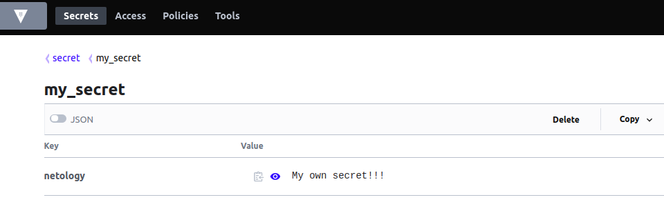

# Домашнее задание к занятию "14.2 Синхронизация секретов с внешними сервисами. Vault"

## Задача 1: Работа с модулем Vault

### Запустить модуль Vault конфигураций через утилиту kubectl в установленном minikube

### Получить значение внутреннего IP пода

```bash
alex@node1:~/devops-projects/myrepo/14_clokub/2 $ sudo kubectl apply -f vault.yaml 
pod/14.2-netology-vault created

alex@node1:~/devops-projects/myrepo/14_clokub/2 $ sudo kubectl get pods
NAME                                  READY   STATUS             RESTARTS   AGE
14.2-netology-vault                   1/1     Running            0          52s
postgresql-db-0                       0/1     Pending            0          6d22h
prod-b-5cbd9dd478-4bllp               1/1     Running            3          7d
prod-f-d6d69db49-v4gh9                1/1     Running            3          7d

alex@node1:~/devops-projects/myrepo/14_clokub/2 $ sudo kubectl get pod 14.2-netology-vault -o json | jq -c '.status.podIPs'
[{"ip":"10.233.90.78"}]

```

### Запустить второй модуль для использования в качестве клиента

```bash
alex@node1:~/devops-projects/myrepo/14_clokub/2 $ sudo kubectl run -i --tty fedora --image=fedora --restart=Never -- sh
[sudo] пароль для alex: 
If you don't see a command prompt, try pressing enter.
sh-5.1# dnf -y install pip
Fedora 34 - x86_64                                                                                              5.6 MB/s |  74 MB     00:13    
Fedora 34 openh264 (From Cisco) - x86_64                                                                        902  B/s | 2.5 kB     00:02    
Fedora Modular 34 - x86_64                                                                                      1.7 MB/s | 4.9 MB     00:02    
Fedora 34 - x86_64 - Updates                                                                                    3.4 MB/s |  26 MB     00:07    
Fedora Modular 34 - x86_64 - Updates                                                                            1.2 MB/s | 4.6 MB     00:03    
Dependencies resolved.
================================================================================================================================================
 Package                                  Architecture                 Version                              Repository                     Size
================================================================================================================================================
Installing:
 python3-pip                              noarch                       21.0.1-3.fc34                        updates                       1.8 M
Installing weak dependencies:
 python3-setuptools                       noarch                       53.0.0-2.fc34                        updates                       840 k

Transaction Summary
================================================================================================================================================
Install  2 Packages

Total download size: 2.6 M
Installed size: 13 M
Downloading Packages:
(1/2): python3-setuptools-53.0.0-2.fc34.noarch.rpm                                                              1.3 MB/s | 840 kB     00:00    
(2/2): python3-pip-21.0.1-3.fc34.noarch.rpm                                                                     2.3 MB/s | 1.8 MB     00:00    
------------------------------------------------------------------------------------------------------------------------------------------------
Total                                                                                                           1.4 MB/s | 2.6 MB     00:01     
Running transaction check
Transaction check succeeded.
Running transaction test
Transaction test succeeded.
Running transaction
  Preparing        :                                                                                                                        1/1 
  Installing       : python3-setuptools-53.0.0-2.fc34.noarch                                                                                1/2 
  Installing       : python3-pip-21.0.1-3.fc34.noarch                                                                                       2/2 
  Running scriptlet: python3-pip-21.0.1-3.fc34.noarch                                                                                       2/2 
  Verifying        : python3-pip-21.0.1-3.fc34.noarch                                                                                       1/2 
  Verifying        : python3-setuptools-53.0.0-2.fc34.noarch                                                                                2/2 

Installed:
  python3-pip-21.0.1-3.fc34.noarch                                    python3-setuptools-53.0.0-2.fc34.noarch                                   

Complete!
sh-5.1# pip install hvac
WARNING: Running pip install with root privileges is generally not a good idea. Try `pip install --user` instead.
Collecting hvac
  Downloading hvac-0.11.0-py2.py3-none-any.whl (148 kB)
     |████████████████████████████████| 148 kB 583 kB/s 
Collecting six>=1.5.0
  Downloading six-1.16.0-py2.py3-none-any.whl (11 kB)
Collecting requests>=2.21.0
  Downloading requests-2.26.0-py2.py3-none-any.whl (62 kB)
     |████████████████████████████████| 62 kB 157 kB/s 
Collecting urllib3<1.27,>=1.21.1
  Downloading urllib3-1.26.6-py2.py3-none-any.whl (138 kB)
     |████████████████████████████████| 138 kB 4.3 MB/s 
Collecting idna<4,>=2.5
  Downloading idna-3.2-py3-none-any.whl (59 kB)
     |████████████████████████████████| 59 kB 906 kB/s 
Collecting charset-normalizer~=2.0.0
  Downloading charset_normalizer-2.0.4-py3-none-any.whl (36 kB)
Collecting certifi>=2017.4.17
  Downloading certifi-2021.5.30-py2.py3-none-any.whl (145 kB)
     |████████████████████████████████| 145 kB 5.8 MB/s 
Installing collected packages: urllib3, idna, charset-normalizer, certifi, six, requests, hvac
Successfully installed certifi-2021.5.30 charset-normalizer-2.0.4 hvac-0.11.0 idna-3.2 requests-2.26.0 six-1.16.0 urllib3-1.26.6
sh-5.1# 
```


### Запустить интепретатор Python и выполнить следующий код, предварительно поменяв IP и токен

Код Питон-скрипта

```code
import hvac
client = hvac.Client(
    url='http://10.233.90.78:8200/',
    token='aiphohTaa0eeHei'
)
client.is_authenticated()

# Пишем секрет
secret_rs= client.secrets.kv.v2.create_or_update_secret(
    path='my_secret',
    secret=dict(netology='My own secret!!!'),
)
print('Secret response of write secret: ',secret_rs)

# Читаем секрет
secret_rs2 = client.secrets.kv.v2.read_secret_version(
    path='my_secret',
)
print('Secret responce of read secret:',secret_rs2)

```

Запустим скрипт

```bash
sh-5.1# python3
Python 3.9.6 (default, Jul 16 2021, 00:00:00) 
[GCC 11.1.1 20210531 (Red Hat 11.1.1-3)] on linux
Type "help", "copyright", "credits" or "license" for more information.
>>> import hvac
>>> client = hvac.Client(
...     url='http://10.233.90.78:8200/',
...     token='aiphohTaa0eeHei'
... )
>>> client.is_authenticated()
True
>>> 
>>> # Пишем секрет
>>> client.secrets.kv.v2.create_or_update_secret(
...     path='my_secret',
...     secret=dict(netology='My own secret!!!'),
... )
{'request_id': '2bb16518-ae9d-e8cf-dc7c-16a4618c4f6c', 'lease_id': '', 'renewable': False, 'lease_duration': 0, 'data': {'created_time': '2021-09-13T16:03:48.971569379Z', 'deletion_time': '', 'destroyed': False, 'version': 1}, 'wrap_info': None, 'warnings': None, 'auth': None}
>>> 
>>> # Читаем секрет
>>> client.secrets.kv.v2.read_secret_version(
...     path='my_secret',
... )
{'request_id': '50f971f4-0952-38e9-f3da-8dc617475550', 'lease_id': '', 'renewable': False, 'lease_duration': 0, 'data': {'data': {'netology': 'My own secret!!!'}, 'metadata': {'created_time': '2021-09-13T16:03:48.971569379Z', 'deletion_time': '', 'destroyed': False, 'version': 1}}, 'wrap_info': None, 'warnings': None, 'auth': None}
>>> 
```

### запуск через файл

```bash
sh-5.1# vi script_hvac.py 
sh-5.1# python3 script_hvac.py 
Secret response of write secret:  {'request_id': '76860cb8-4a85-966c-a78a-001004c9f712', 'lease_id': '', 'renewable': False, 'lease_duration': 0, 'data': {'created_time': '2021-09-13T16:20:37.329768893Z', 'deletion_time': '', 'destroyed': False, 'version': 3}, 'wrap_info': None, 'warnings': None, 'auth': None}
Secret responce of read secret: {'request_id': '6f16742d-eb6e-7e6e-c642-61bfc39c2e42', 'lease_id': '', 'renewable': False, 'lease_duration': 0, 'data': {'data': {'netology': 'My own secret!!!'}, 'metadata': {'created_time': '2021-09-13T16:20:37.329768893Z', 'deletion_time': '', 'destroyed': False, 'version': 3}}, 'wrap_info': None, 'warnings': None, 'auth': None}
sh-5.1# 
```

Скриншот из Web-интерфейса
