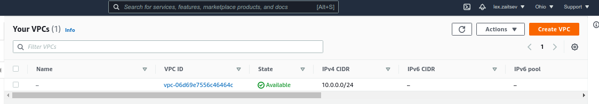
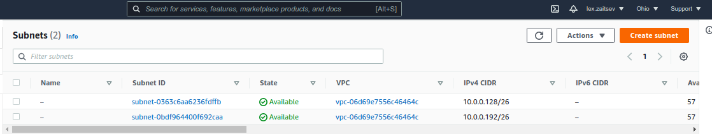
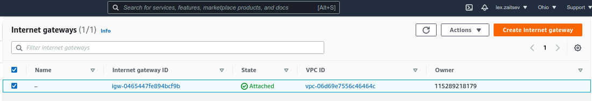
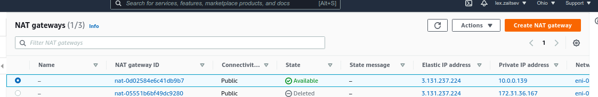
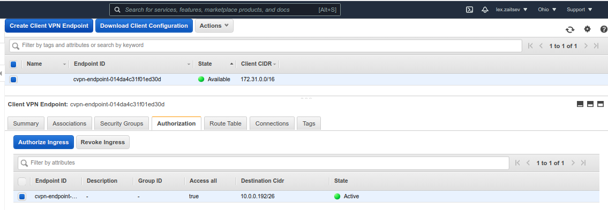

## Решение

### Выполненные команды

```bash
alex@node1:~/devops-projects/myrepo/15_aws $ aws configure list
      Name                    Value             Type    Location
      ----                    -----             ----    --------
   profile                <not set>             None    None
^[[Aaccess_key                <not set>             None    None
secret_key                <not set>             None    None
    region                <not set>             None    None

alex@node1:~/devops-projects/myrepo/15_aws/15_1 $ terraform init

Initializing the backend...

Initializing provider plugins...
- Finding latest version of hashicorp/aws...
- Installing hashicorp/aws v3.64.2...
- Installed hashicorp/aws v3.64.2 (signed by HashiCorp)

Terraform has created a lock file .terraform.lock.hcl to record the provider
selections it made above. Include this file in your version control repository
so that Terraform can guarantee to make the same selections by default when
you run "terraform init" in the future.

Terraform has been successfully initialized!

You may now begin working with Terraform. Try running "terraform plan" to see
any changes that are required for your infrastructure. All Terraform commands
should now work.

If you ever set or change modules or backend configuration for Terraform,
rerun this command to reinitialize your working directory. If you forget, other
commands will detect it and remind you to do so if necessary.

alex@node1:~/devops-projects/myrepo/15_aws/15_1 $ terraform plan

Terraform used the selected providers to generate the following execution plan. Resource actions are indicated with the following symbols:
  + create

Terraform will perform the following actions:

  # aws_ec2_client_vpn_authorization_rule.default_vpn_authorization_rule will be created
  + resource "aws_ec2_client_vpn_authorization_rule" "default_vpn_authorization_rule" {
      + authorize_all_groups   = true
      + client_vpn_endpoint_id = (known after apply)
      + id                     = (known after apply)
      + target_network_cidr    = "172.31.96.0/19"
    }

  # aws_ec2_client_vpn_endpoint.vpn_endpoint will be created
  + resource "aws_ec2_client_vpn_endpoint" "vpn_endpoint" {
      + arn                    = (known after apply)
      + client_cidr_block      = "172.31.0.0/16"
      + description            = "terraform-clientvpn-endpoint"
      + dns_name               = (known after apply)
      + id                     = (known after apply)
      + self_service_portal    = "disabled"
      + server_certificate_arn = "arn:aws:acm:us-west-2:115289218179:certificate/601450aa-2ff3-40bf-bd4e-1259b0ca2691"
      + split_tunnel           = false
      + status                 = (known after apply)
      + tags_all               = (known after apply)
      + transport_protocol     = "udp"

      + authentication_options {
          + root_certificate_chain_arn = "arn:aws:acm:us-west-2:115289218179:certificate/601450aa-2ff3-40bf-bd4e-1259b0ca2691"
          + type                       = "certificate-authentication"
        }

      + connection_log_options {
          + enabled = false
        }
    }

  # aws_ec2_client_vpn_network_association.vpn_to_private__association will be created
  + resource "aws_ec2_client_vpn_network_association" "vpn_to_private__association" {
      + association_id         = (known after apply)
      + client_vpn_endpoint_id = (known after apply)
      + id                     = (known after apply)
      + security_groups        = (known after apply)
      + status                 = (known after apply)
      + subnet_id              = (known after apply)
      + vpc_id                 = (known after apply)
    }

  # aws_eip.nateIP will be created
  + resource "aws_eip" "nateIP" {
      + allocation_id        = (known after apply)
      + association_id       = (known after apply)
      + carrier_ip           = (known after apply)
      + customer_owned_ip    = (known after apply)
      + domain               = (known after apply)
      + id                   = (known after apply)
      + instance             = (known after apply)
      + network_border_group = (known after apply)
      + network_interface    = (known after apply)
      + private_dns          = (known after apply)
      + private_ip           = (known after apply)
      + public_dns           = (known after apply)
      + public_ip            = (known after apply)
      + public_ipv4_pool     = (known after apply)
      + tags_all             = (known after apply)
      + vpc                  = true
    }

  # aws_instance.terraform will be created
  + resource "aws_instance" "terraform" {
      + ami                                  = "ami-0629230e074c580f2"
      + arn                                  = (known after apply)
      + associate_public_ip_address          = (known after apply)
      + availability_zone                    = (known after apply)
      + cpu_core_count                       = (known after apply)
      + cpu_threads_per_core                 = (known after apply)
      + disable_api_termination              = (known after apply)
      + ebs_optimized                        = (known after apply)
      + get_password_data                    = false
      + host_id                              = (known after apply)
      + id                                   = (known after apply)
      + instance_initiated_shutdown_behavior = (known after apply)
      + instance_state                       = (known after apply)
      + instance_type                        = "t2.micro"
      + ipv6_address_count                   = (known after apply)
      + ipv6_addresses                       = (known after apply)
      + key_name                             = (known after apply)
      + monitoring                           = (known after apply)
      + outpost_arn                          = (known after apply)
      + password_data                        = (known after apply)
      + placement_group                      = (known after apply)
      + placement_partition_number           = (known after apply)
      + primary_network_interface_id         = (known after apply)
      + private_dns                          = (known after apply)
      + private_ip                           = (known after apply)
      + public_dns                           = (known after apply)
      + public_ip                            = (known after apply)
      + secondary_private_ips                = (known after apply)
      + security_groups                      = (known after apply)
      + source_dest_check                    = true
      + subnet_id                            = (known after apply)
      + tags_all                             = (known after apply)
      + tenancy                              = (known after apply)
      + user_data                            = (known after apply)
      + user_data_base64                     = (known after apply)
      + vpc_security_group_ids               = (known after apply)

      + capacity_reservation_specification {
          + capacity_reservation_preference = (known after apply)

          + capacity_reservation_target {
              + capacity_reservation_id = (known after apply)
            }
        }

      + ebs_block_device {
          + delete_on_termination = (known after apply)
          + device_name           = (known after apply)
          + encrypted             = (known after apply)
          + iops                  = (known after apply)
          + kms_key_id            = (known after apply)
          + snapshot_id           = (known after apply)
          + tags                  = (known after apply)
          + throughput            = (known after apply)
          + volume_id             = (known after apply)
          + volume_size           = (known after apply)
          + volume_type           = (known after apply)
        }

      + enclave_options {
          + enabled = (known after apply)
        }

      + ephemeral_block_device {
          + device_name  = (known after apply)
          + no_device    = (known after apply)
          + virtual_name = (known after apply)
        }

      + metadata_options {
          + http_endpoint               = (known after apply)
          + http_put_response_hop_limit = (known after apply)
          + http_tokens                 = (known after apply)
        }

      + network_interface {
          + delete_on_termination = (known after apply)
          + device_index          = (known after apply)
          + network_interface_id  = (known after apply)
        }

      + root_block_device {
          + delete_on_termination = (known after apply)
          + device_name           = (known after apply)
          + encrypted             = (known after apply)
          + iops                  = (known after apply)
          + kms_key_id            = (known after apply)
          + tags                  = (known after apply)
          + throughput            = (known after apply)
          + volume_id             = (known after apply)
          + volume_size           = (known after apply)
          + volume_type           = (known after apply)
        }
    }

  # aws_internet_gateway.IGW will be created
  + resource "aws_internet_gateway" "IGW" {
      + arn      = (known after apply)
      + id       = (known after apply)
      + owner_id = (known after apply)
      + tags_all = (known after apply)
      + vpc_id   = (known after apply)
    }

  # aws_nat_gateway.NATgw will be created
  + resource "aws_nat_gateway" "NATgw" {
      + allocation_id        = (known after apply)
      + connectivity_type    = "public"
      + id                   = (known after apply)
      + network_interface_id = (known after apply)
      + private_ip           = (known after apply)
      + public_ip            = (known after apply)
      + subnet_id            = (known after apply)
      + tags_all             = (known after apply)
    }

  # aws_route_table.PrivateRT will be created
  + resource "aws_route_table" "PrivateRT" {
      + arn              = (known after apply)
      + id               = (known after apply)
      + owner_id         = (known after apply)
      + propagating_vgws = (known after apply)
      + route            = [
          + {
              + carrier_gateway_id         = ""
              + cidr_block                 = "0.0.0.0/0"
              + destination_prefix_list_id = ""
              + egress_only_gateway_id     = ""
              + gateway_id                 = ""
              + instance_id                = ""
              + ipv6_cidr_block            = ""
              + local_gateway_id           = ""
              + nat_gateway_id             = (known after apply)
              + network_interface_id       = ""
              + transit_gateway_id         = ""
              + vpc_endpoint_id            = ""
              + vpc_peering_connection_id  = ""
            },
        ]
      + tags_all         = (known after apply)
      + vpc_id           = (known after apply)
    }

  # aws_route_table.PublicRT will be created
  + resource "aws_route_table" "PublicRT" {
      + arn              = (known after apply)
      + id               = (known after apply)
      + owner_id         = (known after apply)
      + propagating_vgws = (known after apply)
      + route            = [
          + {
              + carrier_gateway_id         = ""
              + cidr_block                 = "0.0.0.0/0"
              + destination_prefix_list_id = ""
              + egress_only_gateway_id     = ""
              + gateway_id                 = (known after apply)
              + instance_id                = ""
              + ipv6_cidr_block            = ""
              + local_gateway_id           = ""
              + nat_gateway_id             = ""
              + network_interface_id       = ""
              + transit_gateway_id         = ""
              + vpc_endpoint_id            = ""
              + vpc_peering_connection_id  = ""
            },
        ]
      + tags_all         = (known after apply)
      + vpc_id           = (known after apply)
    }

  # aws_route_table_association.PrivateRTassociation will be created
  + resource "aws_route_table_association" "PrivateRTassociation" {
      + id             = (known after apply)
      + route_table_id = (known after apply)
      + subnet_id      = (known after apply)
    }

  # aws_route_table_association.PublicRTassociation will be created
  + resource "aws_route_table_association" "PublicRTassociation" {
      + id             = (known after apply)
      + route_table_id = (known after apply)
      + subnet_id      = (known after apply)
    }

  # aws_subnet.privatesubnets will be created
  + resource "aws_subnet" "privatesubnets" {
      + arn                             = (known after apply)
      + assign_ipv6_address_on_creation = false
      + availability_zone               = (known after apply)
      + availability_zone_id            = (known after apply)
      + cidr_block                      = "172.31.96.0/19"
      + id                              = (known after apply)
      + ipv6_cidr_block_association_id  = (known after apply)
      + map_public_ip_on_launch         = false
      + owner_id                        = (known after apply)
      + tags_all                        = (known after apply)
      + vpc_id                          = (known after apply)
    }

  # aws_subnet.publicsubnets will be created
  + resource "aws_subnet" "publicsubnets" {
      + arn                             = (known after apply)
      + assign_ipv6_address_on_creation = false
      + availability_zone               = (known after apply)
      + availability_zone_id            = (known after apply)
      + cidr_block                      = "172.31.32.0/19"
      + id                              = (known after apply)
      + ipv6_cidr_block_association_id  = (known after apply)
      + map_public_ip_on_launch         = false
      + owner_id                        = (known after apply)
      + tags_all                        = (known after apply)
      + vpc_id                          = (known after apply)
    }

  # aws_vpc.Main will be created
  + resource "aws_vpc" "Main" {
      + arn                              = (known after apply)
      + assign_generated_ipv6_cidr_block = false
      + cidr_block                       = "172.31.0.0/16"
      + default_network_acl_id           = (known after apply)
      + default_route_table_id           = (known after apply)
      + default_security_group_id        = (known after apply)
      + dhcp_options_id                  = (known after apply)
      + enable_classiclink               = (known after apply)
      + enable_classiclink_dns_support   = (known after apply)
      + enable_dns_hostnames             = (known after apply)
      + enable_dns_support               = true
      + id                               = (known after apply)
      + instance_tenancy                 = "default"
      + ipv6_association_id              = (known after apply)
      + ipv6_cidr_block                  = (known after apply)
      + main_route_table_id              = (known after apply)
      + owner_id                         = (known after apply)
      + tags_all                         = (known after apply)
    }

Plan: 14 to add, 0 to change, 0 to destroy.

───────────────────────────────────────────────────────────────────────────────────────────────────────────────────────────────────────────────

Note: You didn't use the -out option to save this plan, so Terraform can't guarantee to take exactly these actions if you run "terraform apply"
now.

```
## Результат отработки коммнад

### VPC


### Подсети


### Шлюз


### НАТ


### VPN



### примечание

делал по [примеру](https://adamtheautomator.com/terraform-vpc/) в статье.
